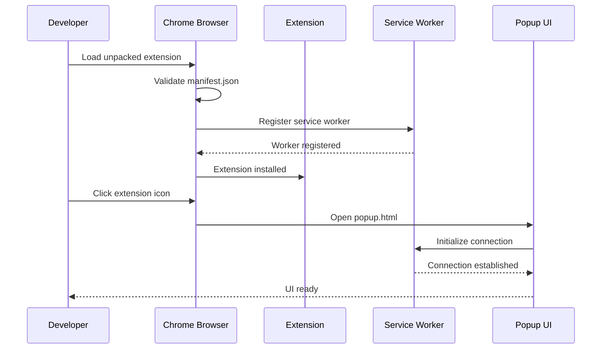
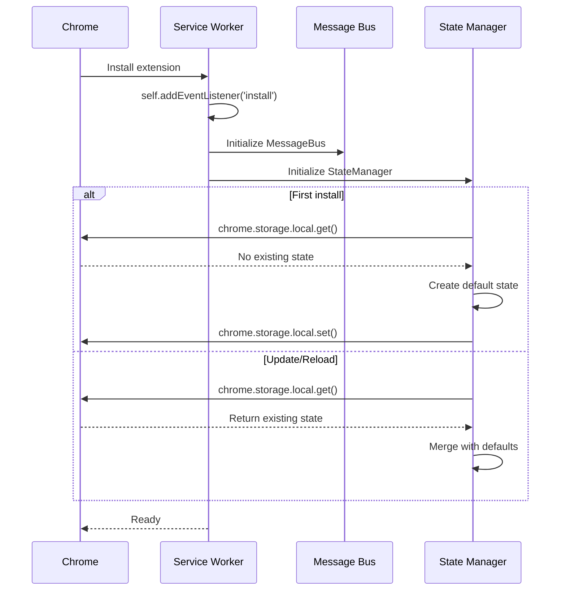
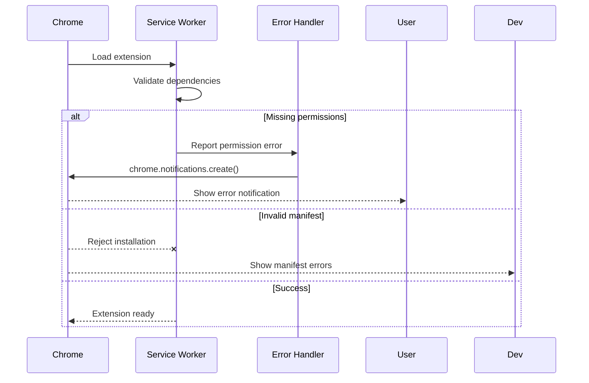

# PBI-1: Chrome Extension Foundation

## Overview
Set up the foundational structure for the Gemini Chrome Extension using Manifest V3, establishing a secure and compliant base for all future development.

## Problem Statement
We need a properly structured Chrome extension that complies with Manifest V3 requirements and provides the basic infrastructure for authentication, messaging, and UI components.

## User Stories
As a developer, I want to set up the Chrome extension foundation with proper Manifest V3 structure so that I can build upon a secure and compliant base.

## Technical Approach

### Key Components
1. Manifest V3 configuration with proper permissions
2. Service worker for background processing
3. Basic popup UI with React/TypeScript
4. Message passing infrastructure
5. OAuth2 configuration for Google authentication

### Architecture

### Core Flow

### Error Handling

## UX/UI Considerations
- Minimal popup UI for initial setup
- Clear visual feedback for extension state
- Error messages displayed prominently
- Loading states during initialization

## Acceptance Criteria
- [ ] Manifest V3 compliant manifest.json with correct permissions
- [ ] Service worker architecture implemented and functioning
- [ ] Basic popup UI renders without errors
- [ ] Extension loads successfully in Chrome Developer mode
- [ ] OAuth2 configuration properly set up in manifest

## Dependencies
- Chrome browser version 88+ (Manifest V3 support)
- Node.js and npm for build tooling
- React and TypeScript for UI development

## Open Questions
- Which specific Chrome permissions will be needed initially?
- Should we request all permissions upfront or use optional permissions?
- What should be the minimum Chrome version requirement?

## Related Tasks
Tasks will be created once this PBI is approved and moved to "Agreed" status.

[View in Backlog](../backlog.md#user-content-1)