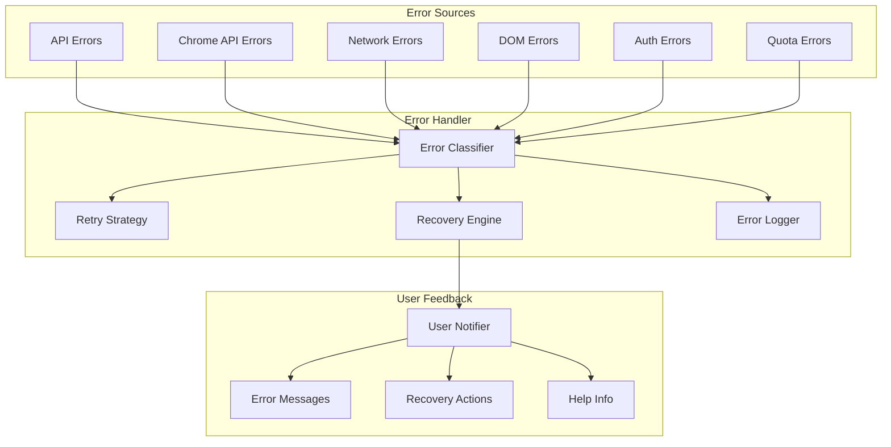
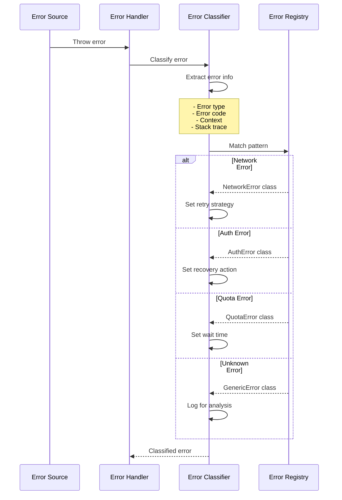
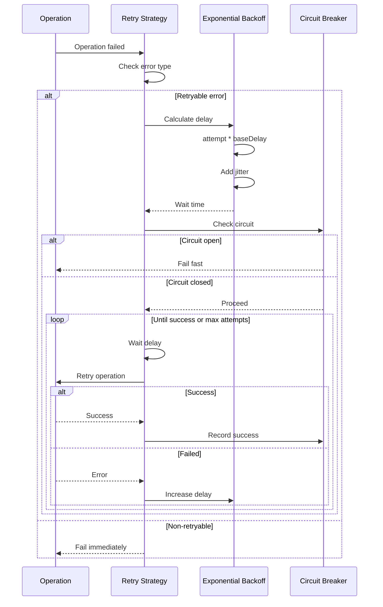
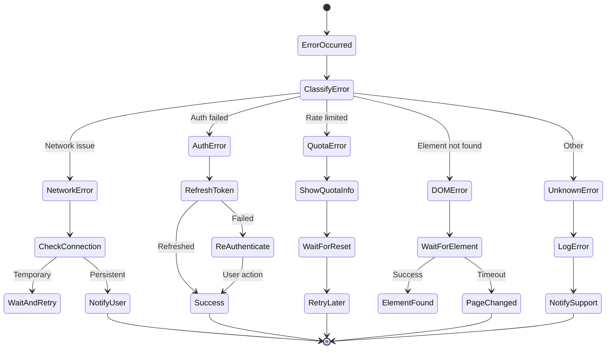
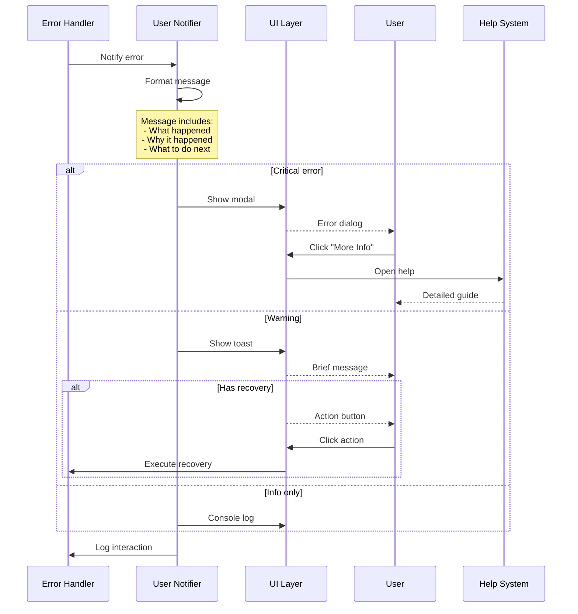
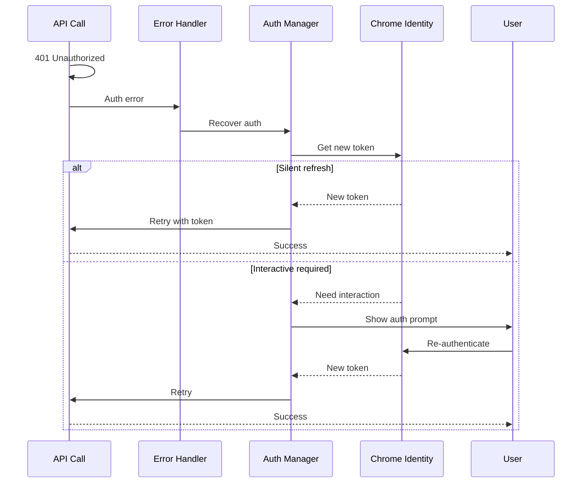
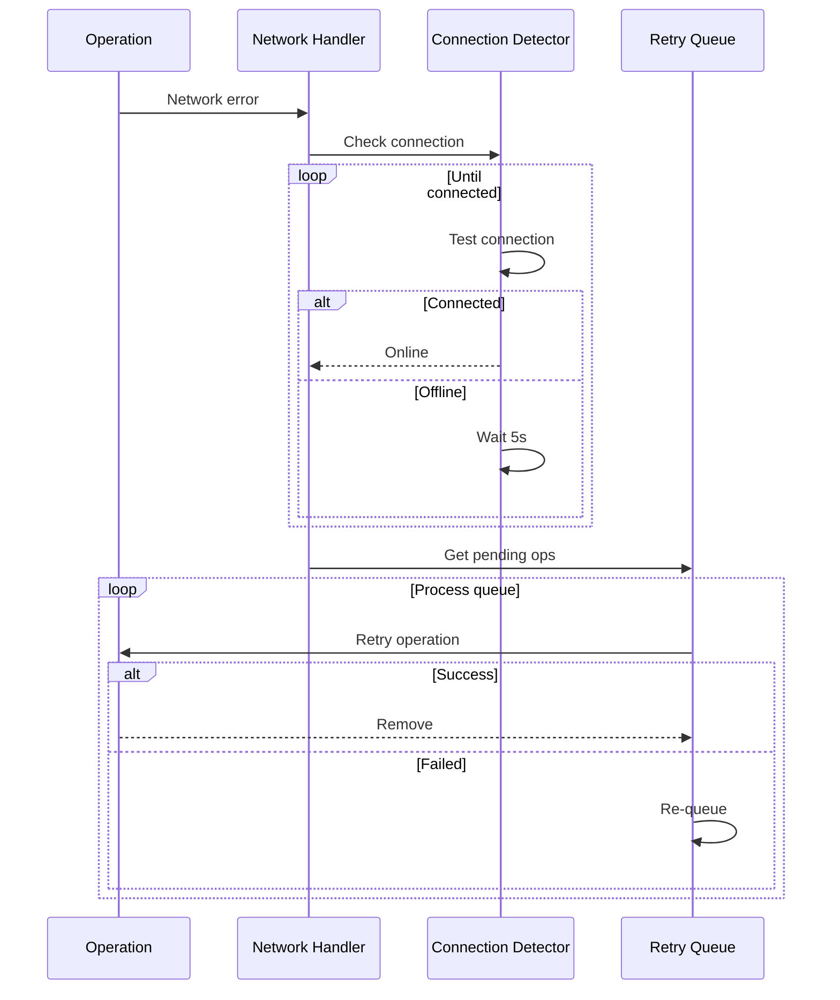
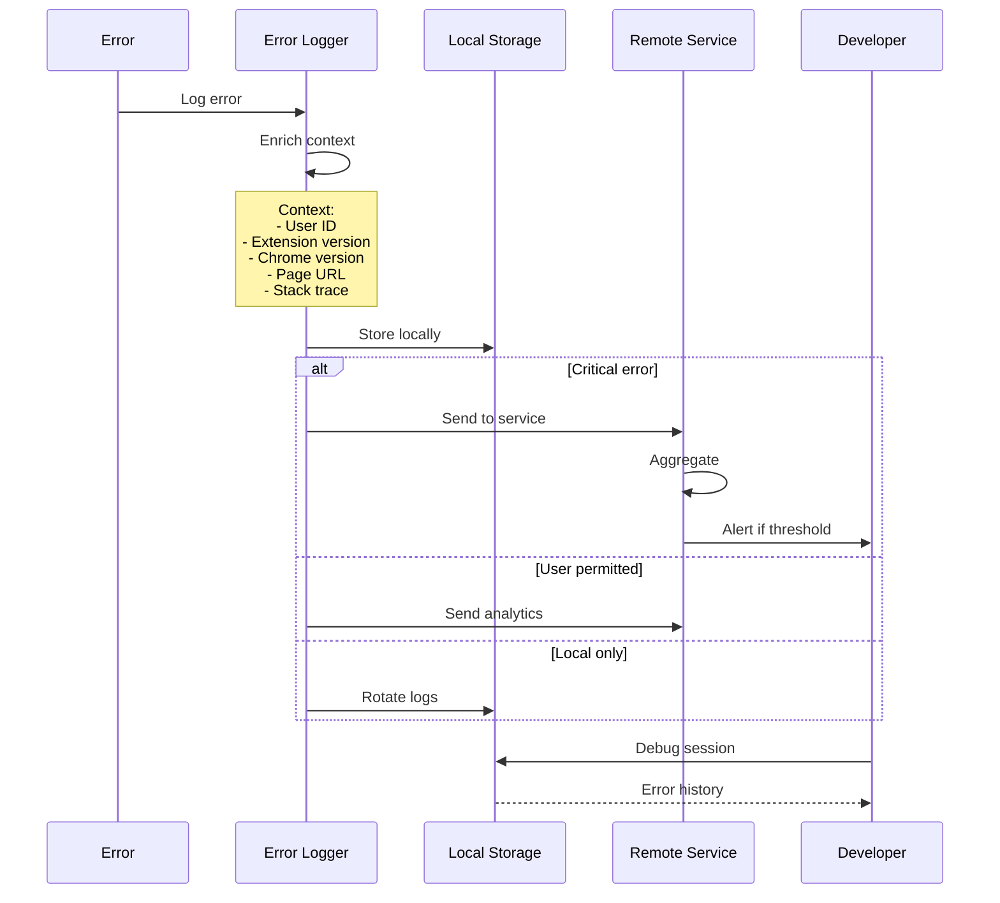

# PBI-10: Error Handling System

## Overview
Implement a comprehensive error handling system that gracefully manages failures, provides clear user feedback, implements smart retry logic, and helps users recover from common issues.

## Problem Statement
Chrome extensions operate in multiple contexts with various failure modes. Users need clear, actionable error messages and automatic recovery where possible, while developers need detailed error tracking for debugging.

## User Stories
As a user, I want the extension to handle errors gracefully so that I understand what went wrong and how to proceed.

## Technical Approach

### Error Handling Architecture

### Error Classification

### Retry Strategy

### Recovery Actions

### User Notification System

### Error Recovery Flows

#### Authentication Recovery

#### Network Recovery

### Error Logging

## Error Types and Handling

### 1. Network Errors
- **Detection**: Fetch failures, timeouts
- **Recovery**: Automatic retry with backoff
- **User feedback**: "Check your connection"

### 2. Authentication Errors
- **Detection**: 401/403 responses
- **Recovery**: Token refresh, re-auth
- **User feedback**: "Sign in again"

### 3. Quota/Rate Limit Errors
- **Detection**: 429 responses
- **Recovery**: Wait and retry
- **User feedback**: "Limit reached, waiting..."

### 4. DOM/Content Script Errors
- **Detection**: Element not found
- **Recovery**: Wait for element, retry
- **User feedback**: "Page structure changed"

### 5. Permission Errors
- **Detection**: Chrome API rejection
- **Recovery**: Request permission
- **User feedback**: "Grant permission to continue"

## UX/UI Considerations
- Non-intrusive error notifications
- Clear, actionable error messages
- Progress indication during recovery
- Help links for common issues
- Error history in settings

## Acceptance Criteria
- [ ] User-friendly error messages for all error types
- [ ] Automatic retry with exponential backoff
- [ ] Clear indication of quota/rate limits
- [ ] Recovery actions for common issues
- [ ] Error reporting mechanism
- [ ] Offline mode handling
- [ ] Error log rotation
- [ ] Help documentation integration
- [ ] Circuit breaker for failing services

## Dependencies
- PBI-1: Extension foundation
- Notification system design
- Logging infrastructure
- Help documentation system

## Open Questions
- Should we implement offline queueing?
- What's the retention period for error logs?
- Should critical errors report automatically?
- Do we need error analytics dashboard?

## Related Tasks
Tasks will be created once this PBI is approved and moved to "Agreed" status.

[View in Backlog](../backlog.md#user-content-10)