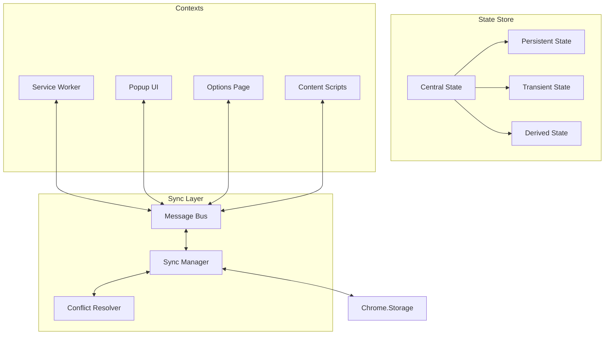
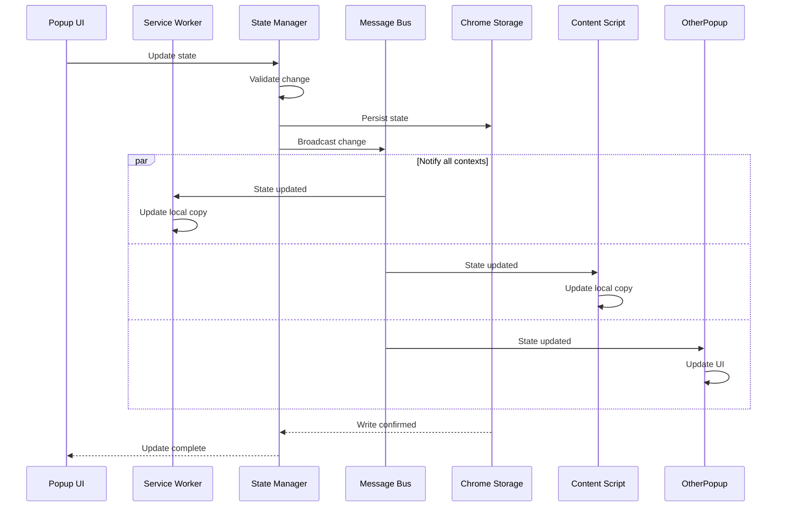
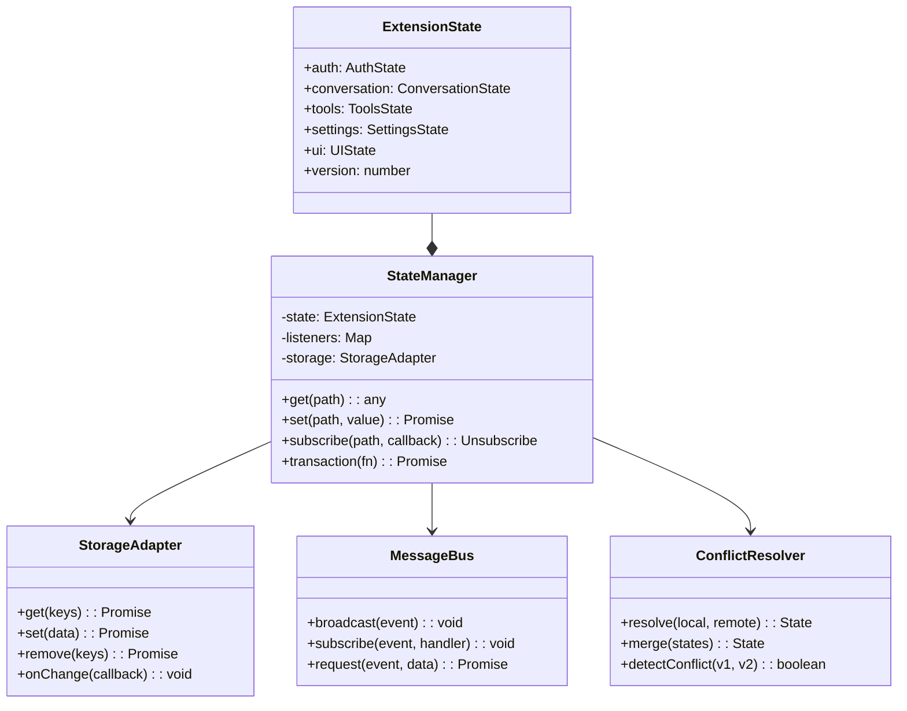
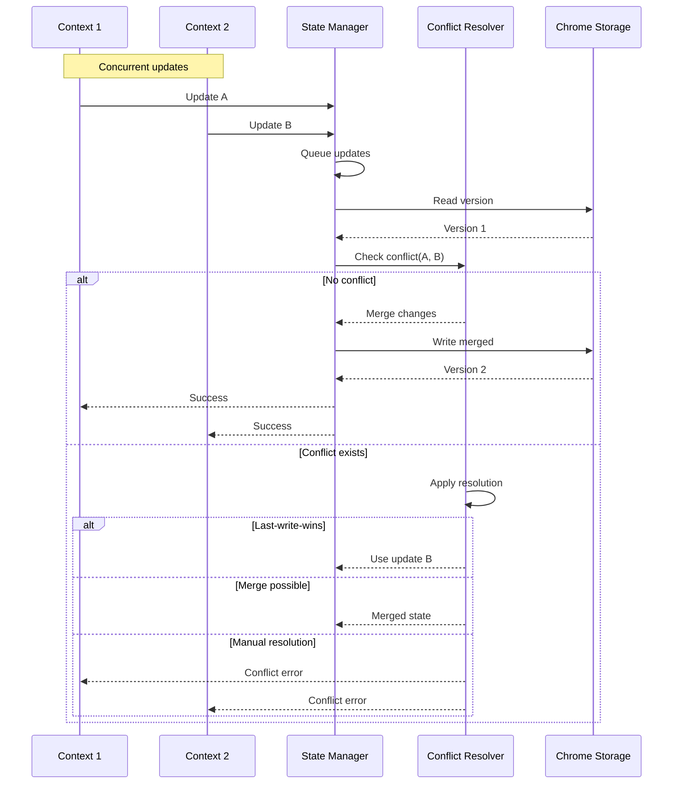
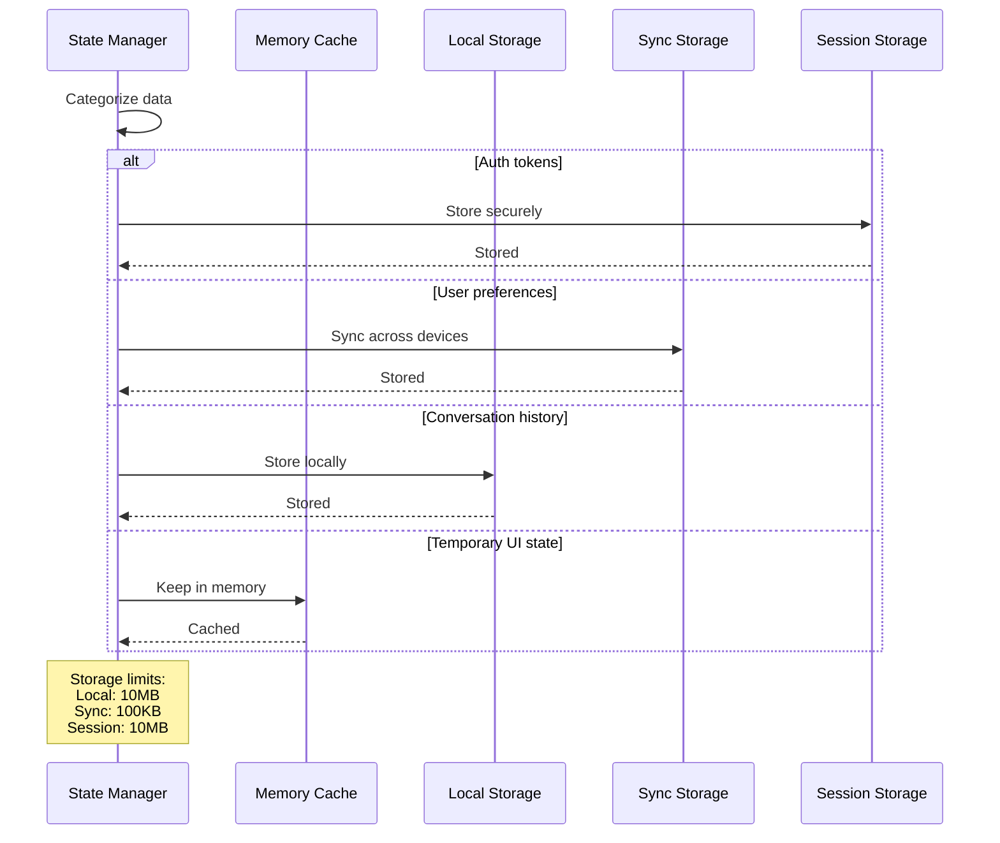
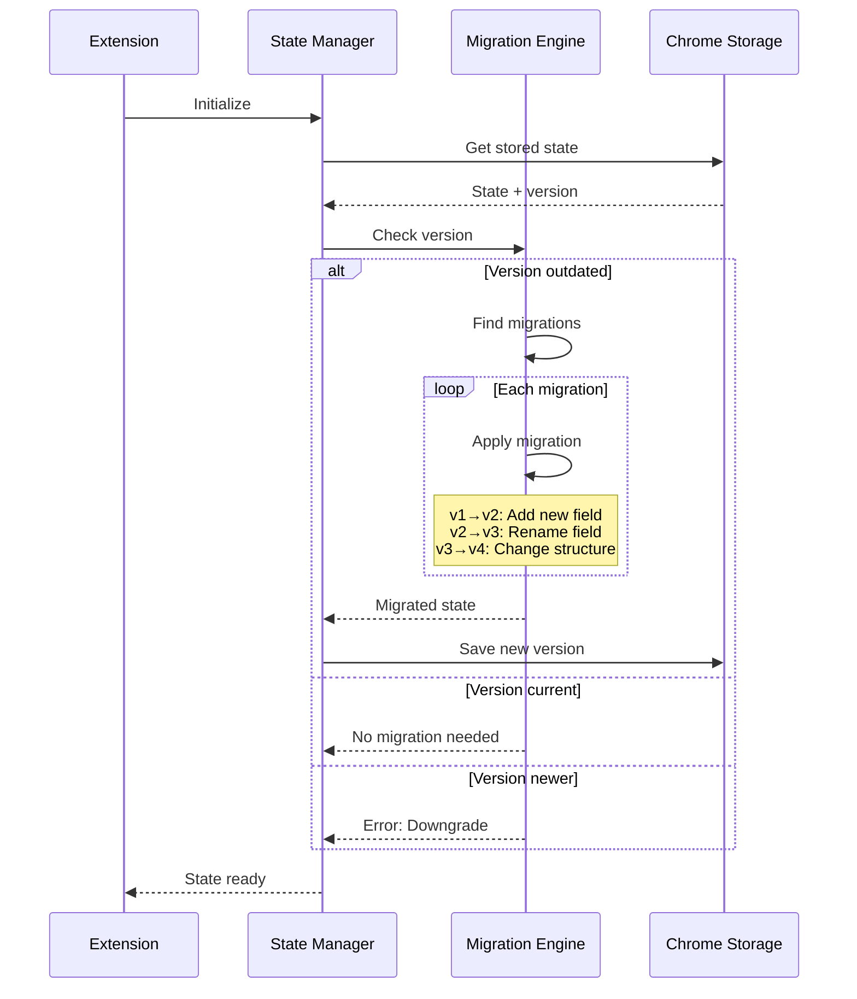
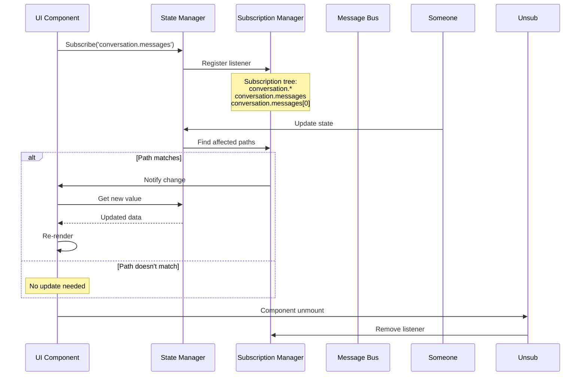
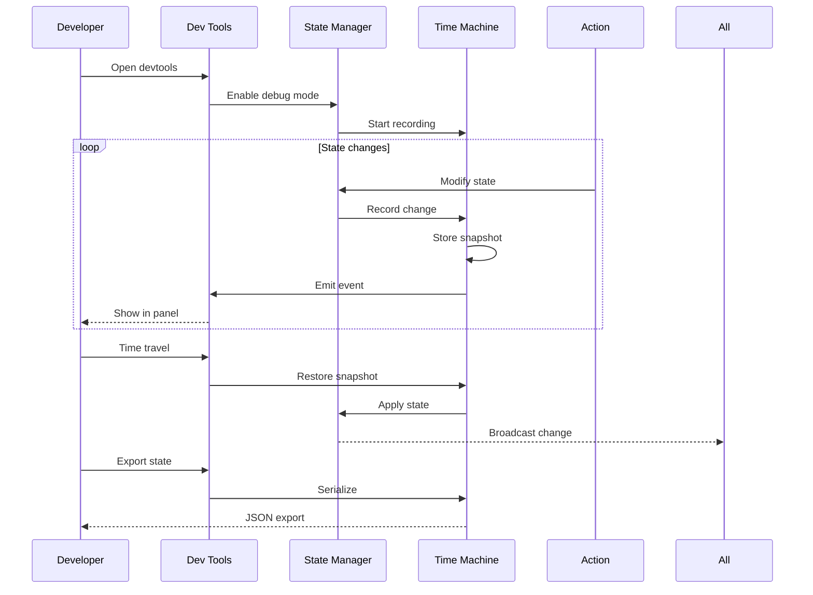

# PBI-11: State Management System

## Overview
Implement a robust state management system that synchronizes data across popup, service worker, and content scripts, with persistence and proper handling of concurrent updates.

## Problem Statement
Chrome extensions have multiple execution contexts that need to share state. Managing state consistency across these contexts while handling persistence and concurrent updates is complex and error-prone without a proper system.

## User Stories
As a developer, I want proper state management across extension contexts so that data stays synchronized.

## Technical Approach

### State Architecture

### State Synchronization Flow

### State Model

### Concurrent Update Handling

### State Persistence Strategy

### State Migration

### Selective Sync

### State Debugging

## State Categories

### 1. Persistent State
- User authentication
- Conversation history
- User preferences
- Tool configurations

### 2. Transient State
- Current tab info
- Active tool execution
- Streaming responses
- UI element states

### 3. Synced State
- User settings
- Whitelisted sites
- Custom shortcuts
- Theme preferences

### 4. Session State
- Auth tokens
- Temporary caches
- Active sessions
- Rate limit counters

## UX/UI Considerations
- Loading states during sync
- Conflict resolution UI
- State reset options
- Debug panel for developers
- Storage usage indicators

## Acceptance Criteria
- [ ] State syncs across popup, background, and content scripts
- [ ] State persists across browser restarts
- [ ] Concurrent updates handled properly
- [ ] Selective state subscriptions work
- [ ] State migrations implemented
- [ ] Clear state reset functionality
- [ ] State debugging tools available
- [ ] Storage quota management
- [ ] Conflict resolution strategies

## Dependencies
- PBI-1: Extension foundation
- Chrome storage APIs
- Message passing system
- TypeScript for type safety

## Open Questions
- Should we use Redux/MobX or custom solution?
- How do we handle storage quota exceeded?
- Should state sync across devices by default?
- Do we need state versioning for migrations?

## Related Tasks
Tasks will be created once this PBI is approved and moved to "Agreed" status.

[View in Backlog](../backlog.md#user-content-11)