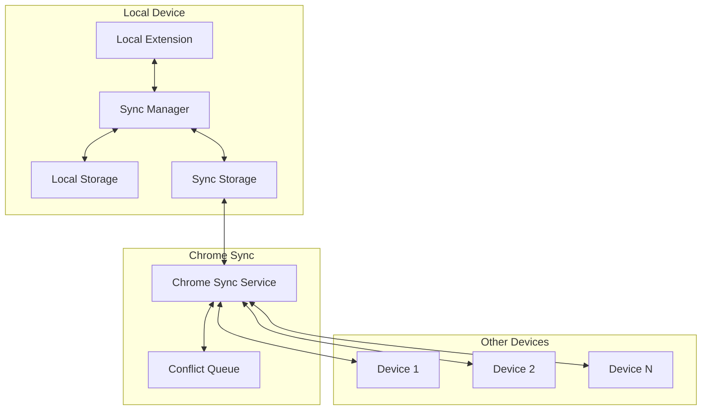
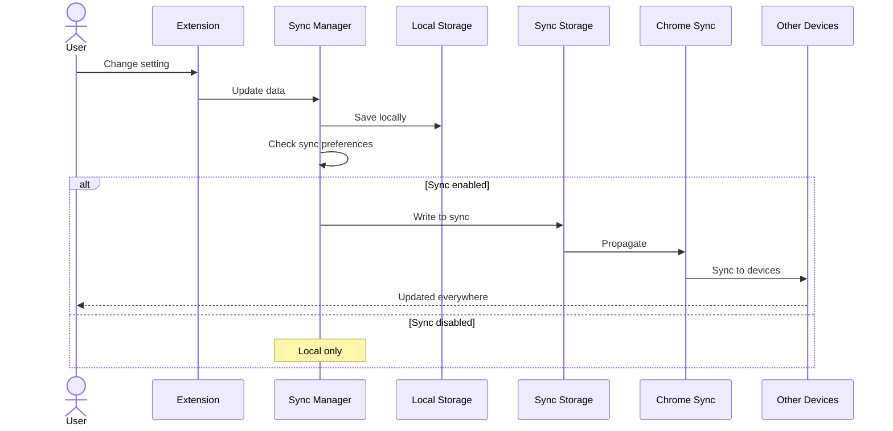
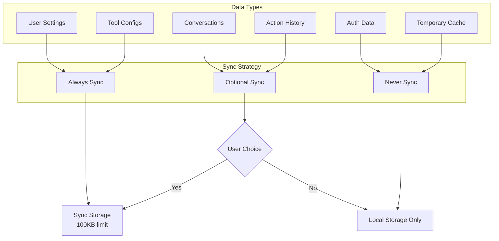
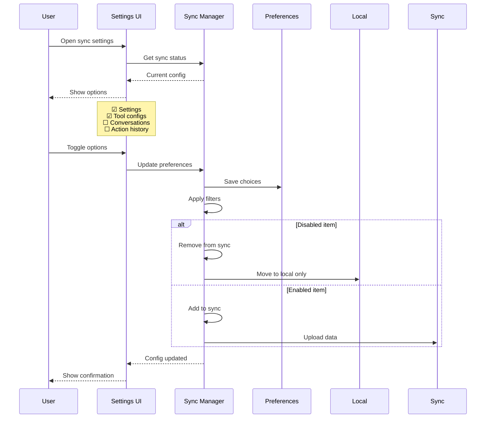
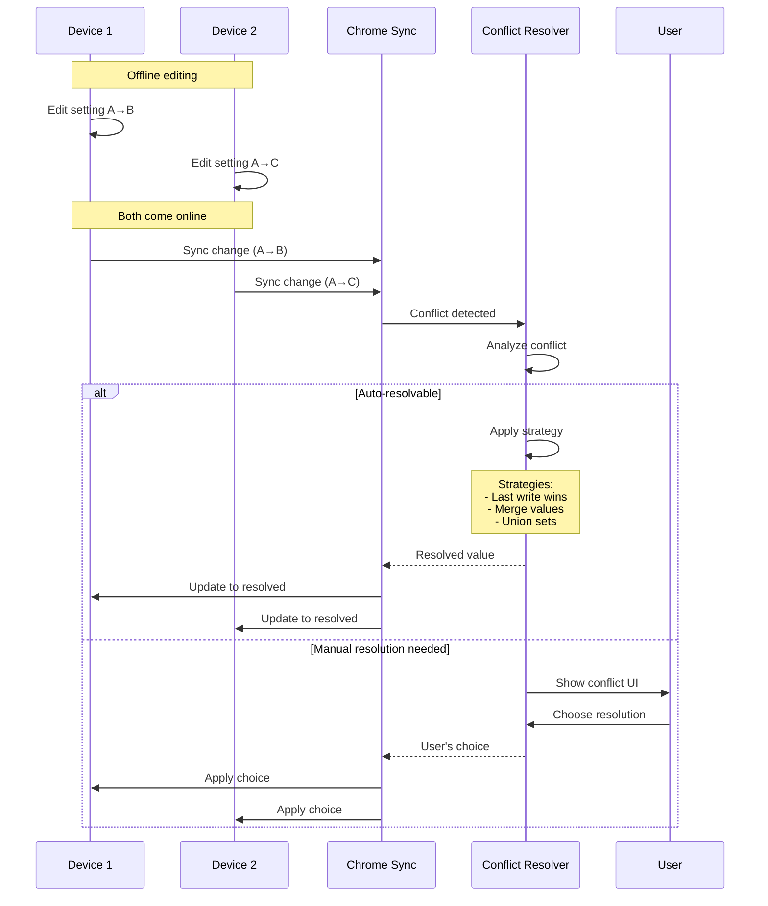
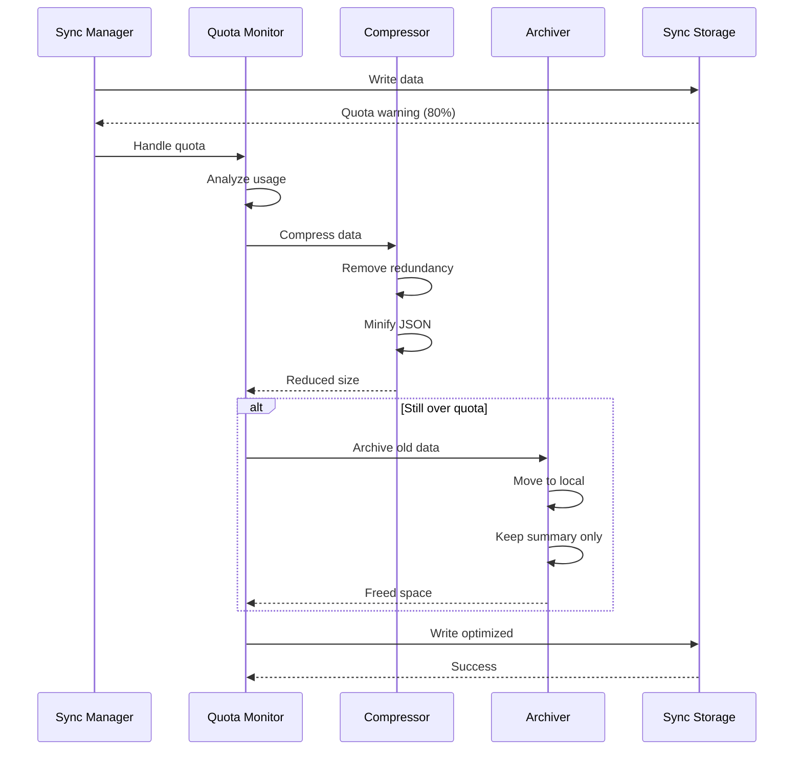
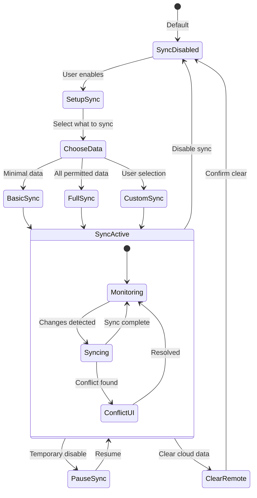
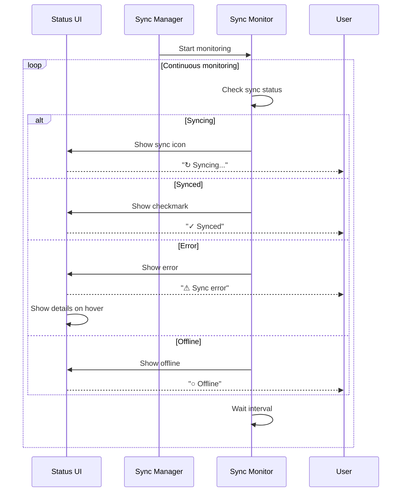
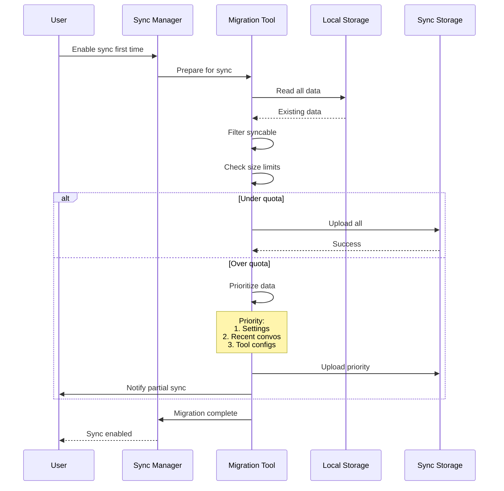

# PBI-12: Cross-Device Sync

## Overview
Implement cross-device synchronization for conversations and settings using Chrome's sync storage API, with selective sync options and proper conflict resolution.

## Problem Statement
Users who use Chrome on multiple devices expect their extension data to be available everywhere. The system needs to sync the right data while respecting privacy preferences and handling conflicts gracefully.

## User Stories
As a user, I want my conversations and settings to sync across devices so that I have a consistent experience.

## Technical Approach

### Sync Architecture

### Sync Flow

### Data Classification

### Selective Sync Configuration

### Conflict Resolution

### Storage Quota Management

### Privacy Controls

### Sync Status Indicators

### Data Migration for Sync

## Sync Features

### 1. What Syncs
- **Always**: Extension settings, themes, shortcuts
- **Optional**: Conversations, tool configurations
- **Never**: Auth tokens, temporary data, caches

### 2. Conflict Resolution
- **Automatic**: Last-write-wins for simple values
- **Smart Merge**: Combine lists and sets
- **Manual**: User chooses for complex conflicts

### 3. Privacy Options
- Selective sync categories
- Clear remote data option
- Pause sync temporarily
- Local-only mode

### 4. Quota Management
- Automatic compression
- Old data archival
- Smart data prioritization
- Usage indicators

## UX/UI Considerations
- Clear sync status in toolbar
- Simple on/off toggle
- Advanced settings for power users
- Conflict resolution dialogs
- Storage usage visualization
- Sync history log

## Acceptance Criteria
- [ ] Chrome sync API integration complete
- [ ] Selective sync for different data types
- [ ] Conflict resolution for concurrent edits
- [ ] Clear sync status indication
- [ ] Option to disable sync
- [ ] Privacy controls implemented
- [ ] Quota management with compression
- [ ] Data migration from local to sync
- [ ] Sync error recovery

## Dependencies
- PBI-11: State management system
- Chrome sync storage API
- Chrome identity for user info
- Compression library

## Open Questions
- Should we encrypt data before syncing?
- How long to retain sync history?
- Should we support manual conflict resolution?
- Do we need sync analytics?

## Related Tasks
Tasks will be created once this PBI is approved and moved to "Agreed" status.

[View in Backlog](../backlog.md#user-content-12)