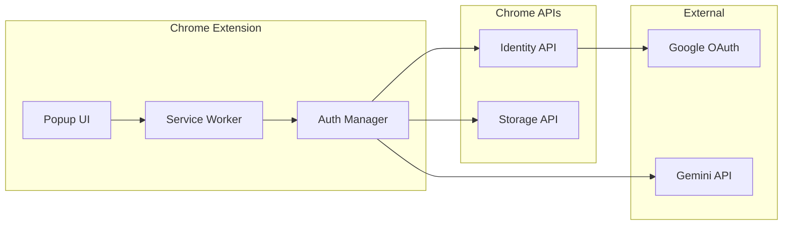
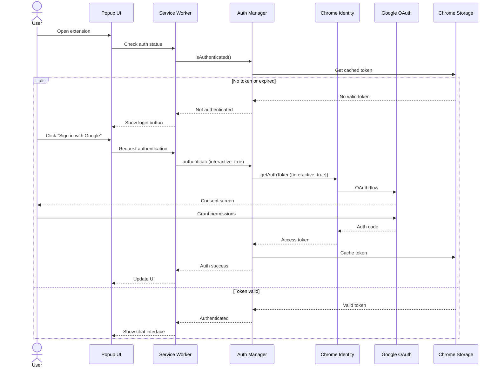
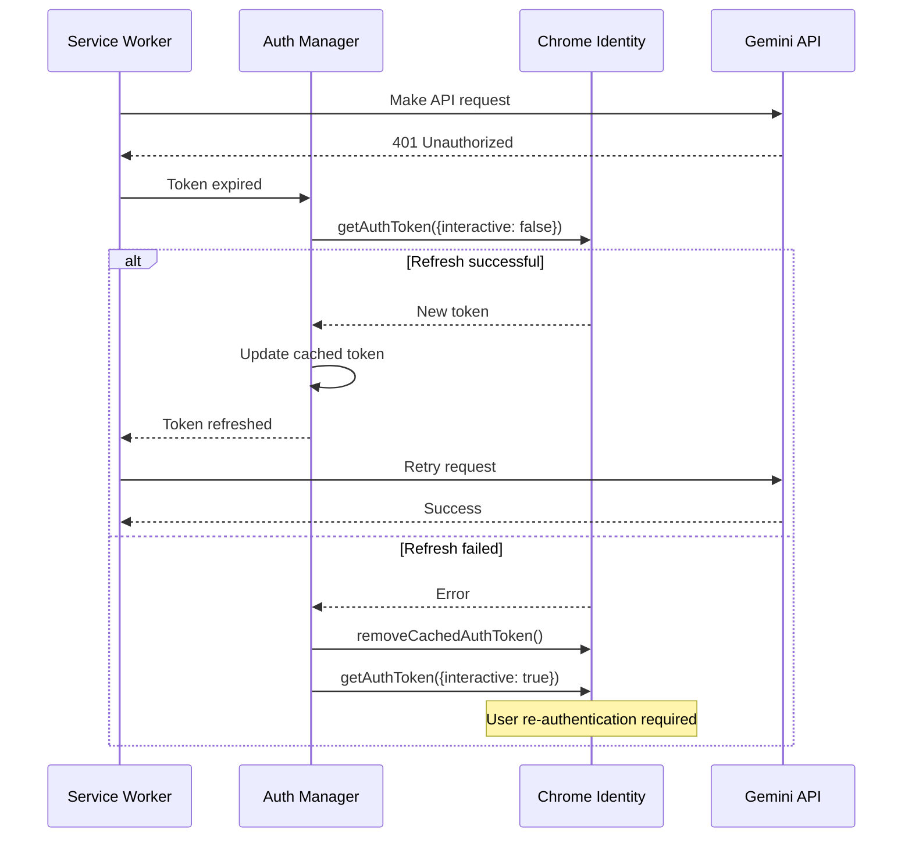
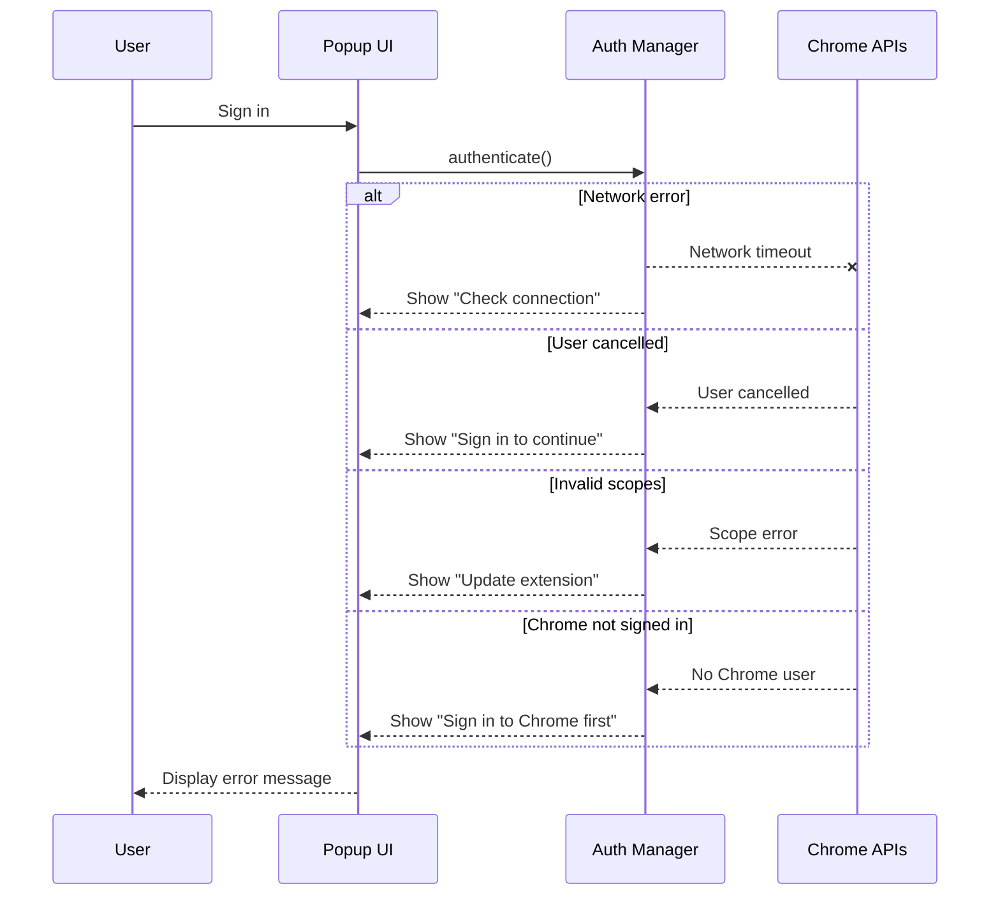
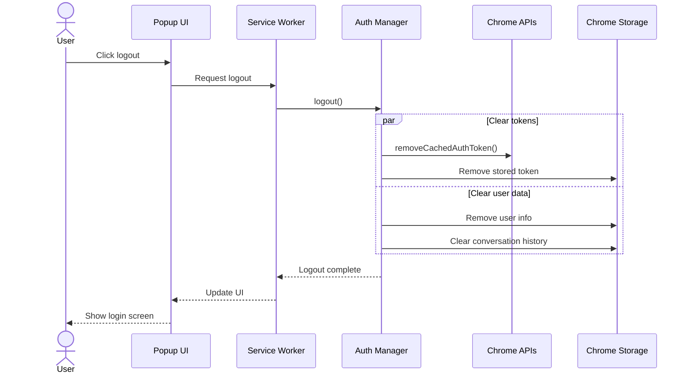

# PBI-2: Google Account Authentication

## Overview
Implement Google OAuth2 authentication to enable users to access Gemini AI capabilities through their existing Google account, leveraging Chrome's identity API for seamless integration.

## Problem Statement
Users need to authenticate with Google to access the generous free tier of Gemini API. The authentication should be seamless, secure, and leverage the user's existing Chrome session without requiring a separate login.

## User Stories
As a user, I want to authenticate with my Google account so that I can access Gemini AI capabilities.

## Technical Approach

### Authentication Architecture

### Core Authentication Flow

### Token Refresh Flow

### Error Handling

### Logout Flow

## UX/UI Considerations
- One-click authentication using existing Chrome session
- Clear visual feedback during authentication
- Persistent login state indicator
- Graceful error messages
- Easy logout option

## Acceptance Criteria
- [ ] One-click Google authentication using Chrome identity API
- [ ] Tokens stored securely in chrome.storage.local
- [ ] Automatic token refresh before expiration
- [ ] Clear, user-friendly error messages for auth failures
- [ ] Logout functionality clears all auth data
- [ ] Auth state persists across browser sessions

## Dependencies
- PBI-1: Chrome Extension Foundation must be completed
- Chrome identity API permissions in manifest
- Google OAuth2 client configuration

## Open Questions
- Should we implement a token refresh buffer (e.g., refresh 5 minutes before expiry)?
- How should we handle users with multiple Google accounts?
- Should auth state sync across devices via chrome.storage.sync?

## Related Tasks
Tasks will be created once this PBI is approved and moved to "Agreed" status.

[View in Backlog](../backlog.md#user-content-2)