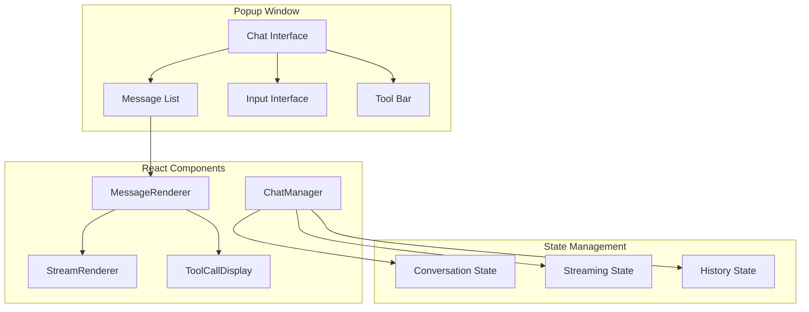
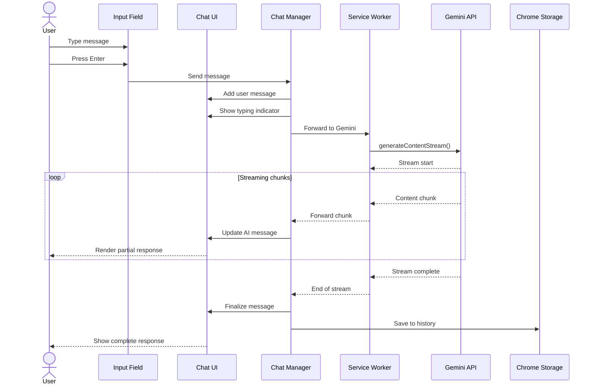
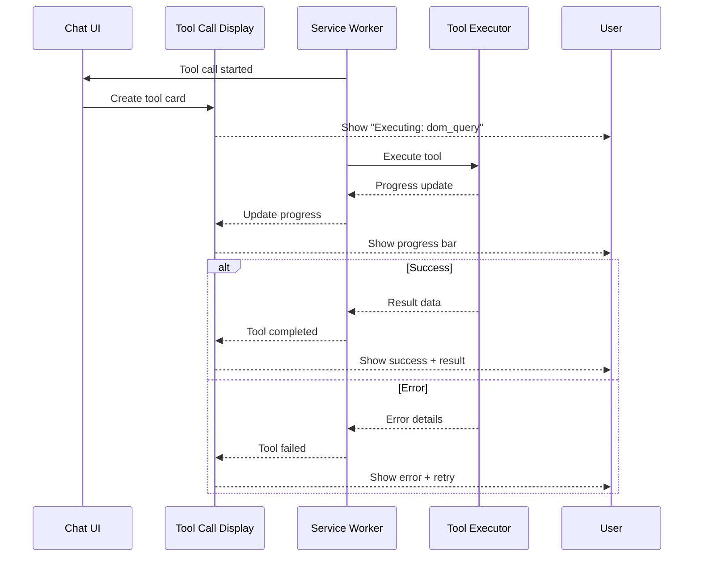
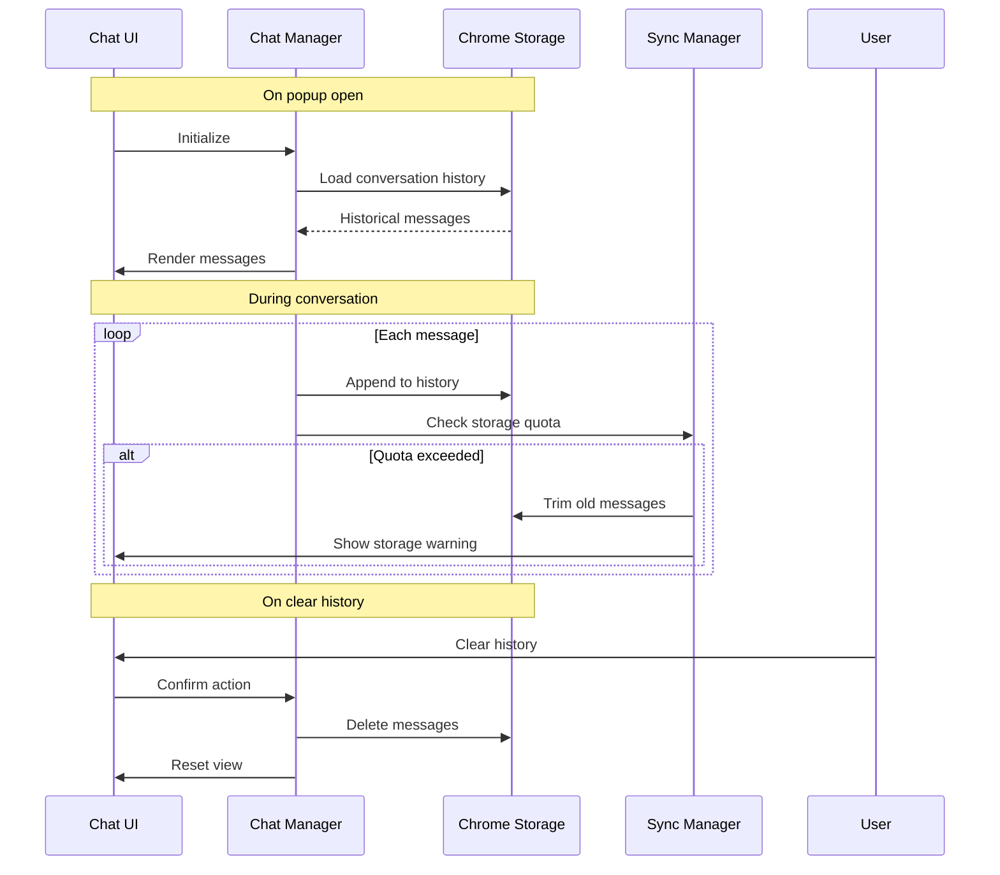
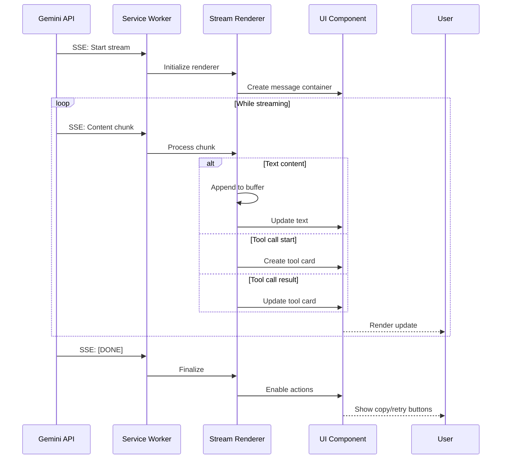
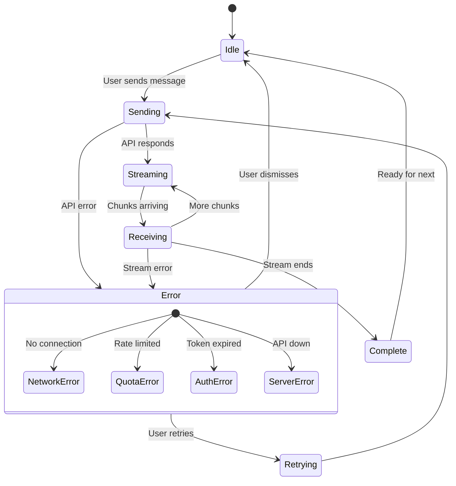

# PBI-3: Conversation Interface

## Overview
Create an intuitive chat interface within the extension popup that enables users to have streaming conversations with Gemini AI, with persistent history and real-time response rendering.

## Problem Statement
Users need a familiar chat-like interface to interact with Gemini AI while browsing. The interface should support streaming responses, maintain conversation history, and provide clear visual feedback during AI processing.

## User Stories
As a user, I want to have conversations with Gemini through the extension popup so that I can get AI assistance while browsing.

## Technical Approach

### UI Architecture

### Message Flow

### Tool Execution Display

### History Management

### Streaming Response Handling

### Error States

## UX/UI Considerations
- Familiar chat interface similar to popular messaging apps
- Real-time streaming with smooth text rendering
- Clear visual distinction between user and AI messages
- Loading states and progress indicators
- Tool execution visualization
- Error messages with actionable recovery options
- Keyboard shortcuts (Enter to send, Shift+Enter for newline)
- Auto-scroll to latest message
- Message timestamps on hover

## Acceptance Criteria
- [ ] Chat interface displays in popup with message history
- [ ] Real-time streaming responses render smoothly
- [ ] Conversation persists across popup open/close sessions
- [ ] Clear visual indication when AI is "thinking" or streaming
- [ ] Graceful error handling with retry options
- [ ] Tool executions display with progress and results
- [ ] Messages are stored in chrome.storage.local
- [ ] Copy message functionality
- [ ] Clear history option with confirmation

## Dependencies
- PBI-1: Extension foundation must be complete
- PBI-2: Authentication must be implemented
- React and TypeScript setup
- Chrome storage API permissions

## Open Questions
- Should we implement message search functionality?
- How many messages should we store in history?
- Should we support message editing?
- Do we need conversation branching/threads?

## Related Tasks
Tasks will be created once this PBI is approved and moved to "Agreed" status.

[View in Backlog](../backlog.md#user-content-3)