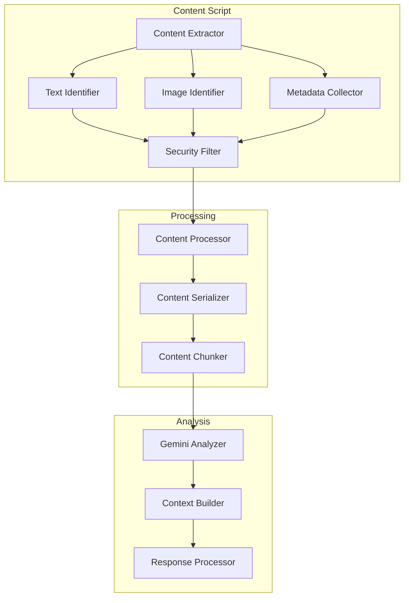
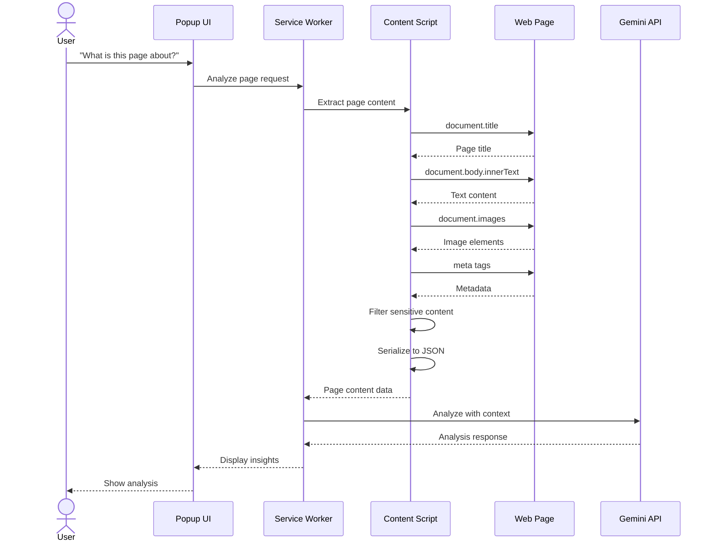
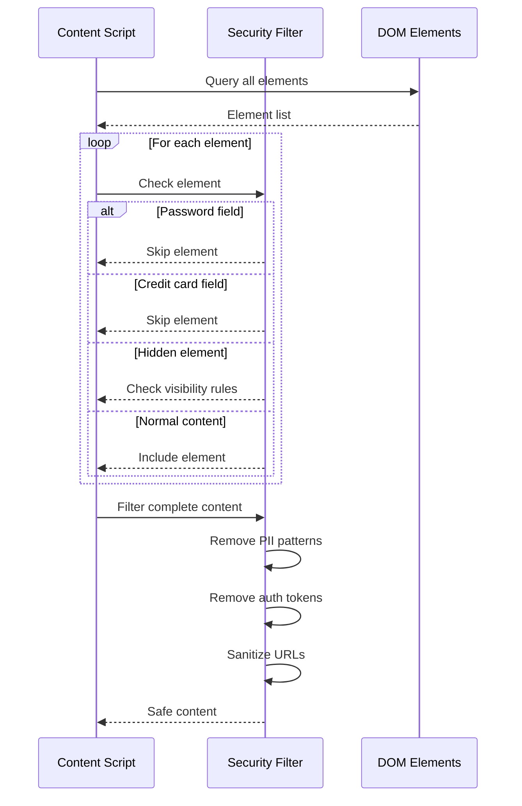
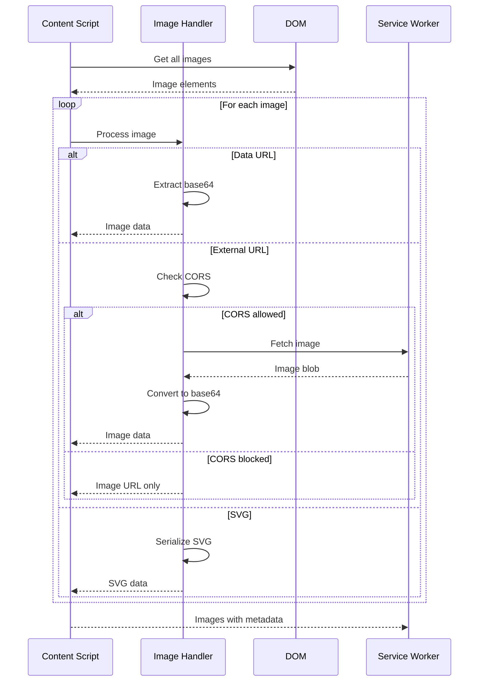
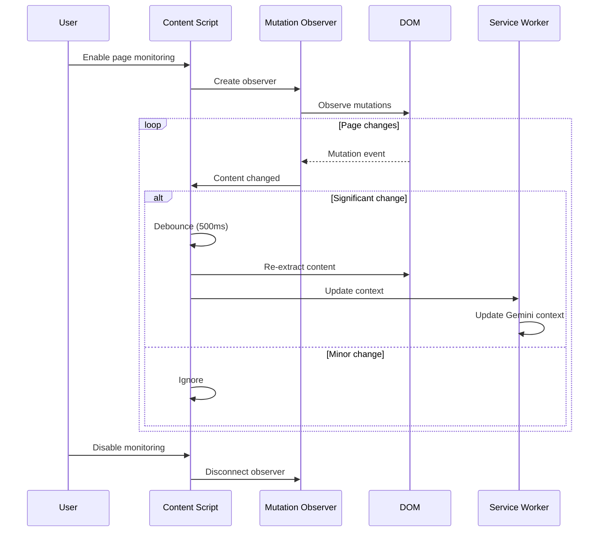
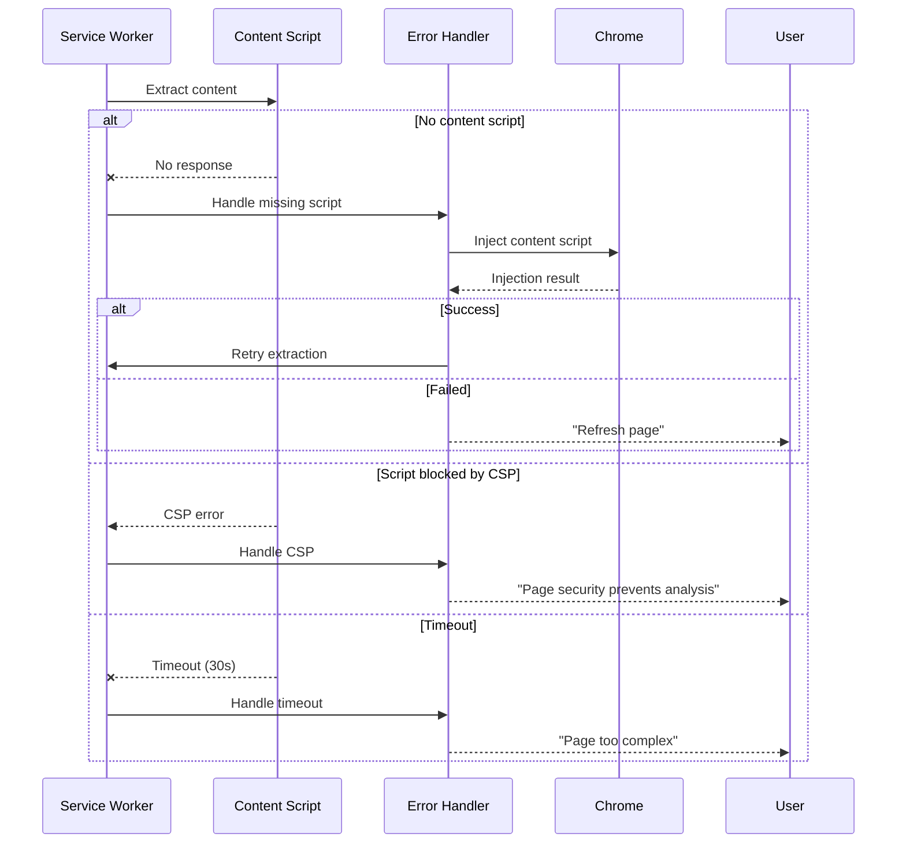

# PBI-4: Page Content Analysis

## Overview
Enable Gemini to analyze and understand the content of the current web page, allowing users to ask questions and get insights about what they're viewing.

## Problem Statement
Users want to leverage AI to understand, summarize, and interact with web page content. The extension needs to safely extract page content, respect security boundaries, and provide this context to Gemini for analysis.

## User Stories
As a user, I want Gemini to analyze the current web page content so that I can get insights and assistance about what I'm viewing.

## Technical Approach

### Content Extraction Architecture

### Content Extraction Flow

### Security Filtering

### Image Handling

### Dynamic Content Handling

### Error Handling

## UX/UI Considerations
- Clear indication of what content is being analyzed
- Privacy-focused messaging about data handling
- Visual feedback during extraction
- Option to exclude certain page elements
- Summary of extracted content before sending

## Acceptance Criteria
- [ ] Extract page text content accurately
- [ ] Handle images with proper CORS compliance
- [ ] Extract relevant metadata (title, description, etc.)
- [ ] Filter out sensitive information (passwords, credit cards)
- [ ] Respect page security boundaries (CSP, X-Frame-Options)
- [ ] Handle dynamic content with mutation observers
- [ ] Provide clear feedback about extraction process
- [ ] Support common content types (HTML, text, images)
- [ ] Graceful handling of extraction failures

## Dependencies
- PBI-1: Extension foundation
- PBI-3: Conversation interface for displaying results
- Content script permissions in manifest
- ActiveTab permission for current page access

## Open Questions
- Should we support PDF content extraction?
- How should we handle very large pages?
- Should extracted content be cached?
- Do we need user controls for extraction depth?

## Related Tasks
Tasks will be created once this PBI is approved and moved to "Agreed" status.

[View in Backlog](../backlog.md#user-content-4)