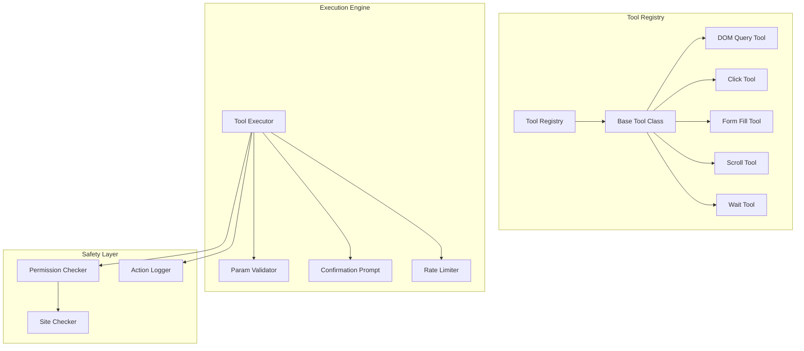
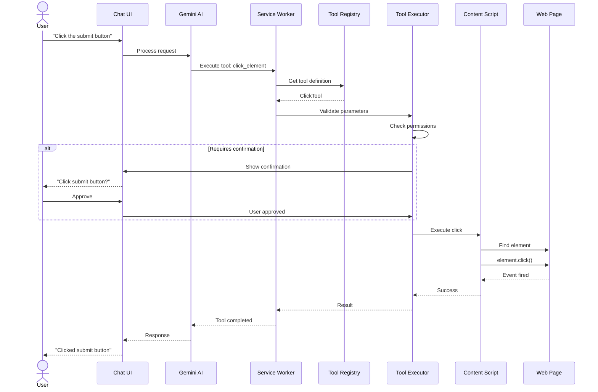
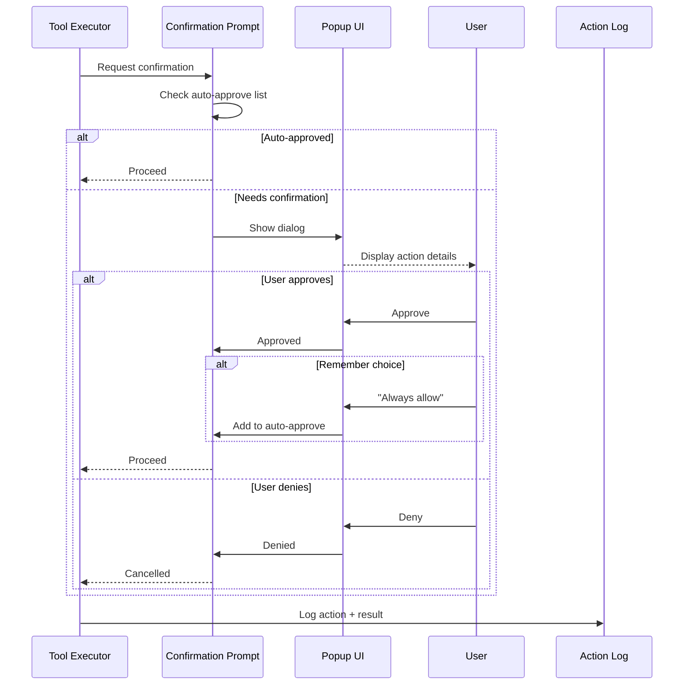
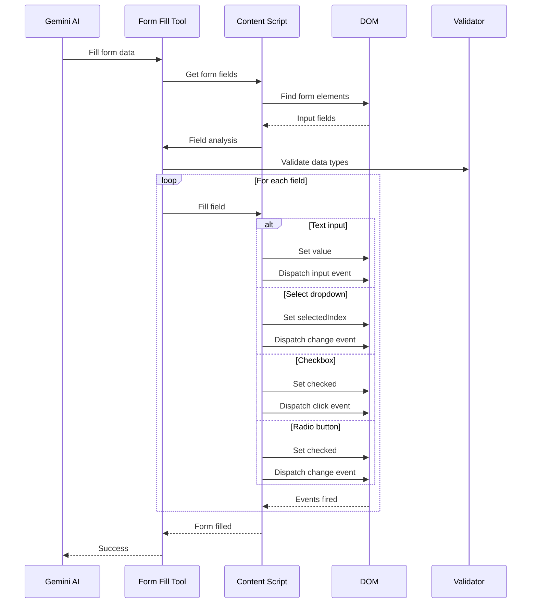
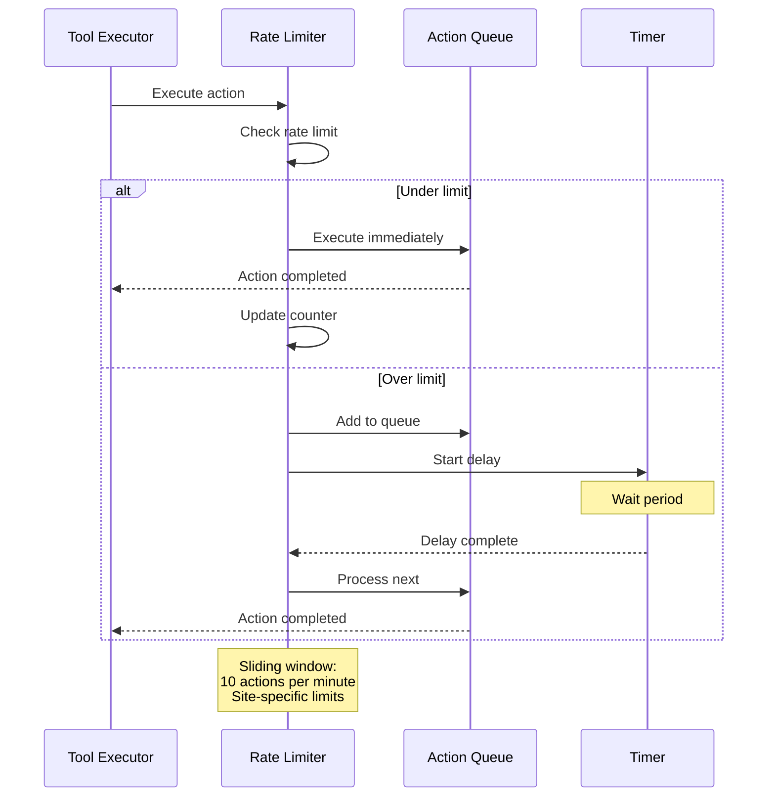
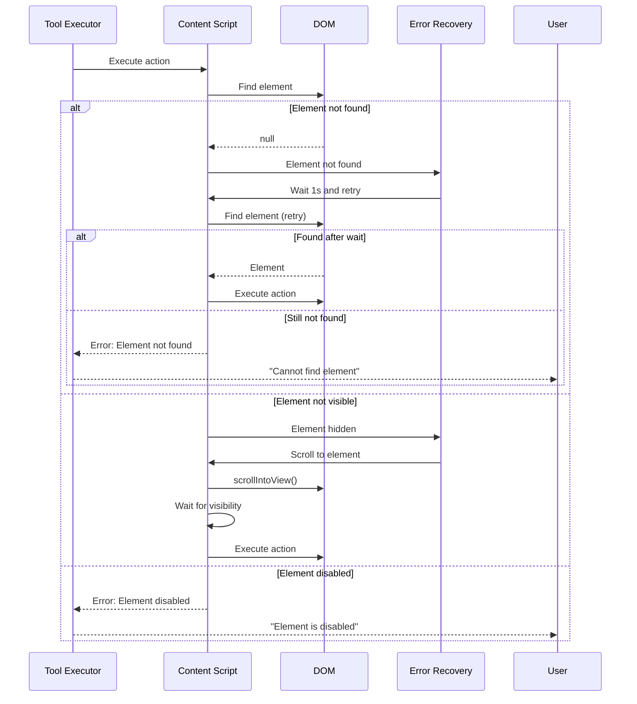

# PBI-5: Web Automation Tools

## Overview
Implement core web automation tools that allow Gemini to perform actions on web pages, including clicking elements, filling forms, and navigating, with appropriate safety confirmations.

## Problem Statement
Users want to automate repetitive web tasks through natural language commands. The system needs to safely execute DOM manipulations while providing clear feedback and maintaining user control.

## User Stories
As a user, I want Gemini to perform automated actions on web pages so that I can save time on repetitive tasks.

## Technical Approach

### Tool System Architecture

### Tool Execution Flow

### Safety Confirmation Flow

### Form Filling Flow

### Rate Limiting

### Error Recovery

## Available Tools

### 1. DOM Query Tool
- Find elements by CSS selector
- Count matching elements
- Extract text content
- Get element attributes

### 2. Click Tool
- Click buttons and links
- Support for dynamic elements
- Handle navigation after click

### 3. Form Fill Tool
- Fill text inputs
- Select dropdowns
- Check/uncheck boxes
- Handle radio buttons

### 4. Scroll Tool
- Scroll to elements
- Scroll by pixels
- Scroll to top/bottom

### 5. Wait Tool
- Wait for elements to appear
- Wait for specific conditions
- Custom wait times

## UX/UI Considerations
- Clear confirmation dialogs for actions
- Visual highlighting of target elements
- Progress indicators for multi-step actions
- Ability to stop automation mid-process
- Action history and undo capabilities

## Acceptance Criteria
- [ ] DOM element selection using CSS selectors
- [ ] Click automation with element highlighting
- [ ] Form filling with type validation
- [ ] Safety confirmations for destructive actions
- [ ] Visual feedback during automation
- [ ] Rate limiting to prevent abuse
- [ ] Error handling with retry logic
- [ ] Action logging for audit trail
- [ ] Ability to cancel running automations

## Dependencies
- PBI-1: Extension foundation
- PBI-3: Conversation interface
- PBI-7: Tool system architecture
- Content script permissions
- ActiveTab permission

## Open Questions
- Should we support XPath selectors in addition to CSS?
- How should we handle file upload inputs?
- Do we need recording/playback functionality?
- Should we support keyboard event simulation?

## Related Tasks
Tasks will be created once this PBI is approved and moved to "Agreed" status.

[View in Backlog](../backlog.md#user-content-5)