# PBI-6: YouTube Playlist Management Tools

## Overview
Create specialized tools for YouTube playlist management that handle the platform's dynamic content loading, implement proper rate limiting, and provide bulk operations with safety measures.

## Problem Statement
YouTube playlists can contain thousands of items, and managing them manually is time-consuming. Users need automated tools that can handle YouTube's dynamic loading, respect rate limits, and safely perform bulk operations.

## User Stories
As a user, I want specialized tools for YouTube playlist management so that I can efficiently organize my playlists.

## Technical Approach

### YouTube Tool Architecture

### Playlist Analysis Flow

### Bulk Remove Flow

### Dynamic Content Handling

### Rate Limiting Strategy

### Error Recovery

### Progress Monitoring

```mermaid
sequenceDiagram
    participant User
    participant UI as Progress UI
    participant BC as Batch Controller
    participant PM as Progress Monitor
    
    BC->>PM: Start job (100 items)
    PM->>UI: Initialize progress bar
    UI-->>User: "0/100 complete"
    
    loop Processing
        BC->>PM: Item completed
        PM->>PM: Update stats
        PM->>UI: Update display
        
        UI-->>User: "25/100 complete"
        UI-->>User: "~3 min remaining"
        UI-->>User: Show progress bar
        
        alt User cancels
            User->>UI: Click cancel
            UI->>BC: Cancel signal
            BC->>BC: Stop processing
            BC->>PM: Job cancelled
            PM->>UI: Show final stats
            UI-->>User: "Cancelled: 25/100"
        end
    end
    
    PM->>UI: Job complete
    UI-->>User: "✓ 100/100 complete"
```

## YouTube-Specific Features

### 1. Smart Selection
- Select by date range
- Select by video duration
- Select by channel
- Select by title pattern

### 2. Batch Operations
- Remove in batches
- Reorder by criteria
- Move between playlists
- Export playlist data

### 3. Safety Features
- Dry run mode
- Undo capability (within session)
- Operation preview
- Automatic backups

## UX/UI Considerations
- Clear progress indicators with time estimates
- Ability to pause/resume operations
- Preview of items to be affected
- Confirmation with item count
- Real-time progress updates
- Cancel button always visible

## Acceptance Criteria
- [ ] List all playlist items with metadata
- [ ] Bulk remove with batching and rate limiting
- [ ] Handle YouTube's infinite scroll
- [ ] Progress indication with time estimates
- [ ] Confirmation dialogs show item count
- [ ] Graceful handling of YouTube errors
- [ ] Resume capability after interruption
- [ ] Respect YouTube's rate limits
- [ ] Work with different playlist sizes

## Dependencies
- PBI-5: Web automation tools foundation
- PBI-7: Tool system architecture
- Content script access to YouTube
- Mutation Observer API support

## Open Questions
- Should we support moving items between playlists?
- How should we handle private/deleted videos?
- Do we need playlist backup functionality?
- Should we support collaborative playlists?

## Related Tasks
Tasks will be created once this PBI is approved and moved to "Agreed" status.

[View in Backlog](../backlog.md#user-content-6)