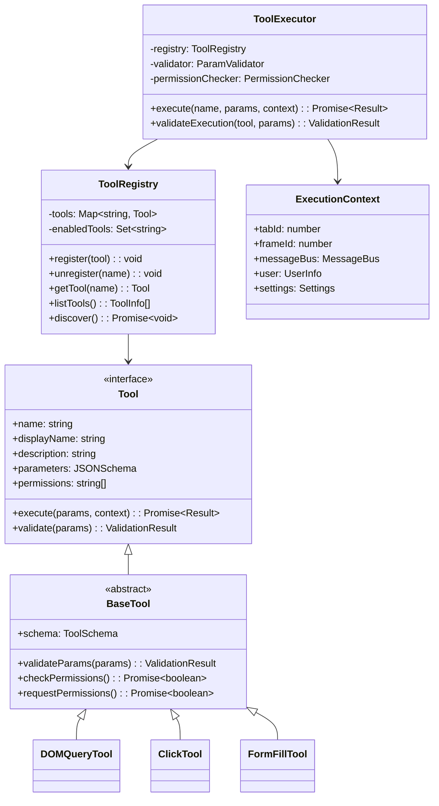
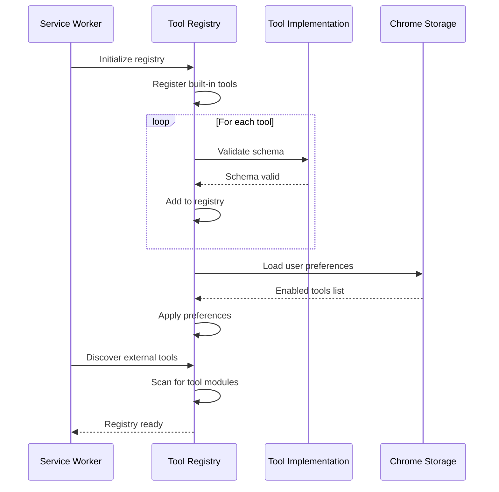
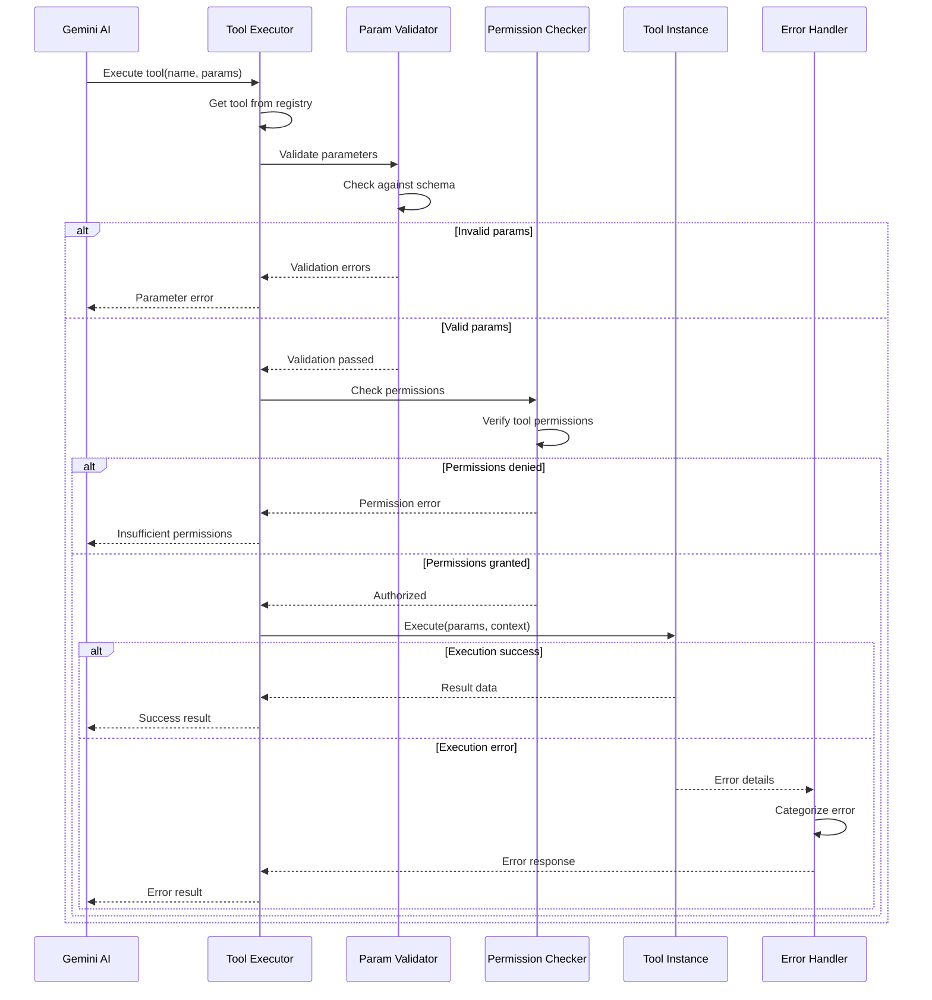
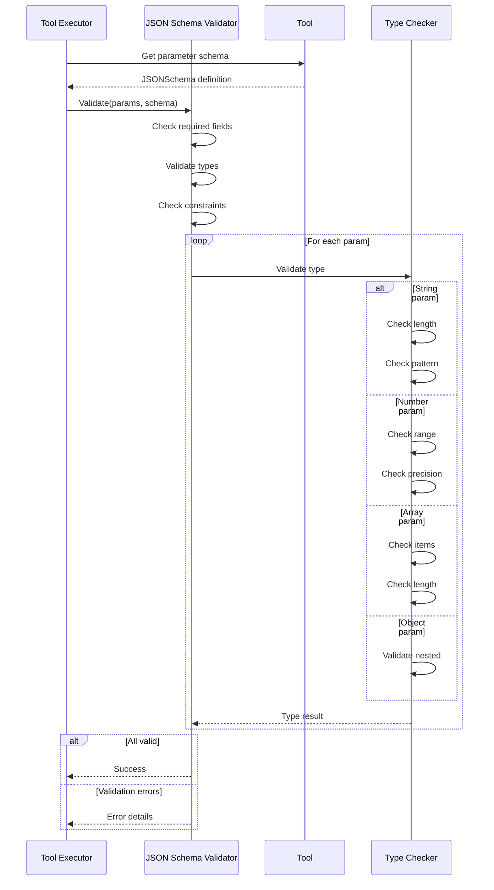
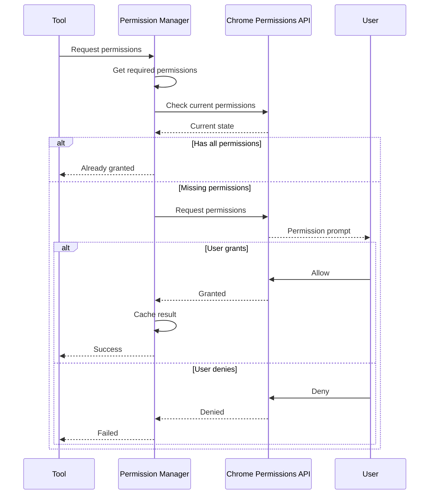
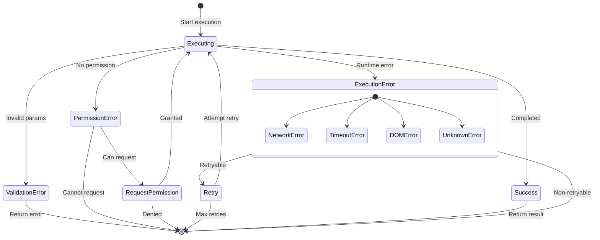
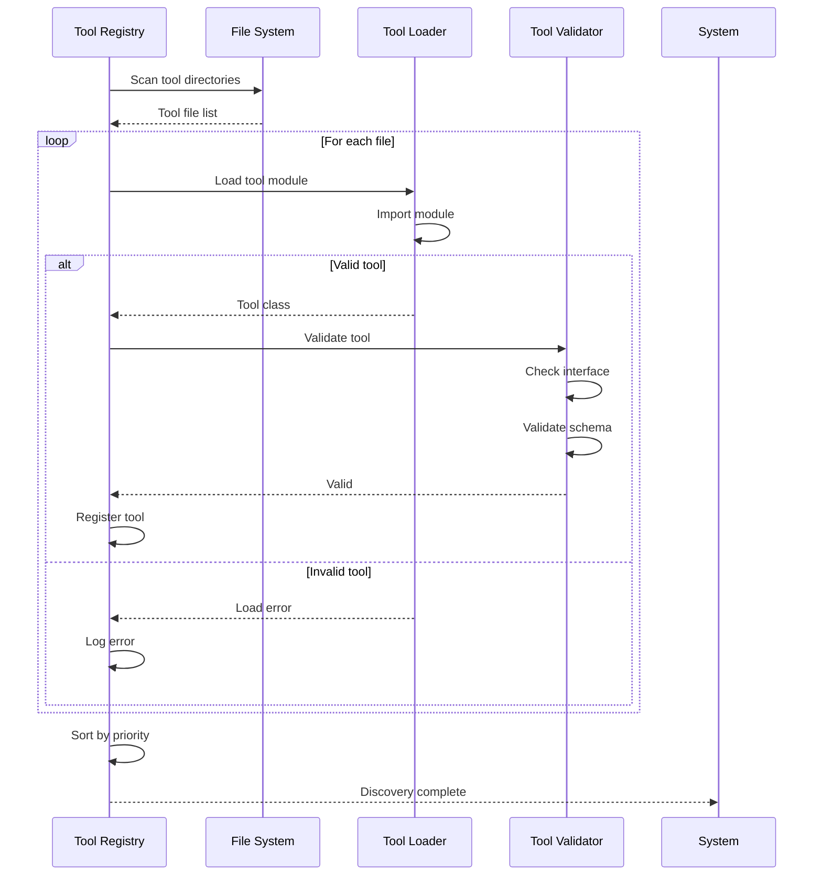

# PBI-7: Tool System Architecture

## Overview
Design and implement a robust, extensible tool system that provides a consistent interface for all automation capabilities, with built-in validation, error handling, and execution tracking.

## Problem Statement
The extension needs a well-architected tool system that can handle various automation tasks consistently, validate parameters, manage permissions, and provide a foundation for future tool development.

## User Stories
As a developer, I want a robust tool system architecture so that I can easily add new automation capabilities.

## Technical Approach

### Tool System Architecture

### Tool Registration Flow

### Tool Execution Flow

### Parameter Validation

### Permission Management

### Error Handling Architecture

### Tool Discovery

## Core Components

### 1. Base Tool Class
- Standard interface implementation
- Parameter validation
- Permission checking
- Error handling
- Execution context

### 2. Tool Registry
- Dynamic tool registration
- Tool discovery
- Enable/disable management
- Tool metadata
- Search and filtering

### 3. Tool Executor
- Execution orchestration
- Context management
- Result formatting
- Error propagation
- Execution tracking

### 4. Parameter Validator
- JSON Schema validation
- Type checking
- Custom validators
- Error messages
- Default values

### 5. Permission Manager
- Permission checking
- Dynamic requests
- User preferences
- Permission caching
- Audit logging

## UX/UI Considerations
- Clear tool descriptions in UI
- Parameter hints and examples
- Validation error messages
- Permission request dialogs
- Tool execution feedback

## Acceptance Criteria
- [ ] Base tool class with standard interface
- [ ] Tool registry with dynamic registration
- [ ] Parameter validation using JSON Schema
- [ ] Permission management system
- [ ] Consistent error handling
- [ ] Tool execution tracking
- [ ] Tool discovery mechanism
- [ ] Cancellation support
- [ ] Comprehensive logging

## Dependencies
- PBI-1: Extension foundation
- TypeScript for type safety
- JSON Schema library
- Chrome permissions API

## Open Questions
- Should tools support progress reporting?
- How should we handle tool versioning?
- Do we need tool categories/tags?
- Should tools have priority levels?

## Related Tasks
Tasks will be created once this PBI is approved and moved to "Agreed" status.

[View in Backlog](../backlog.md#user-content-7)