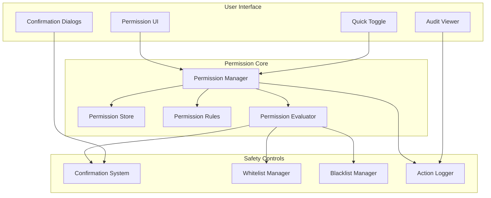
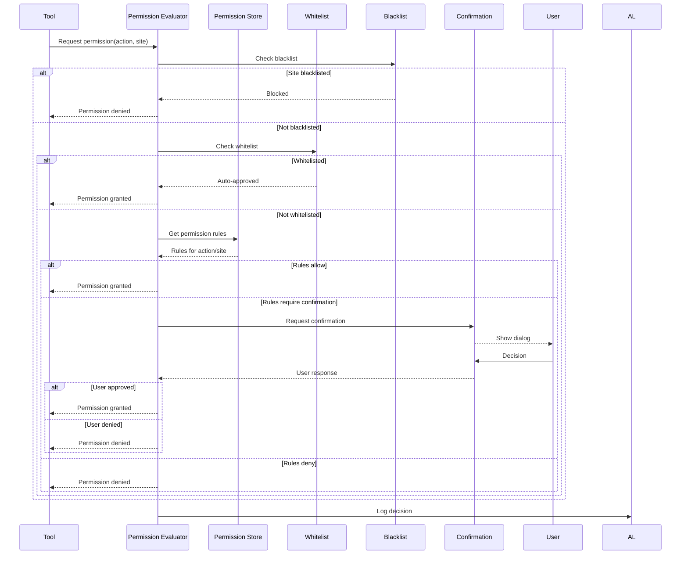
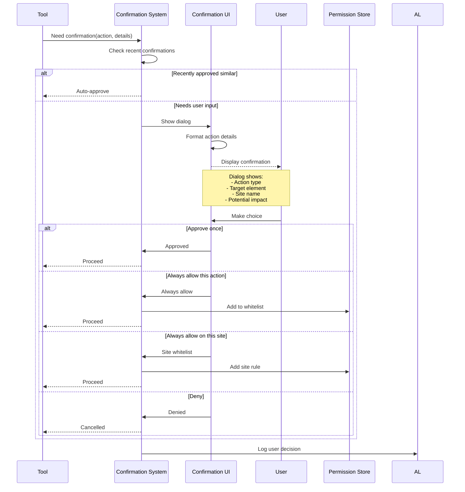
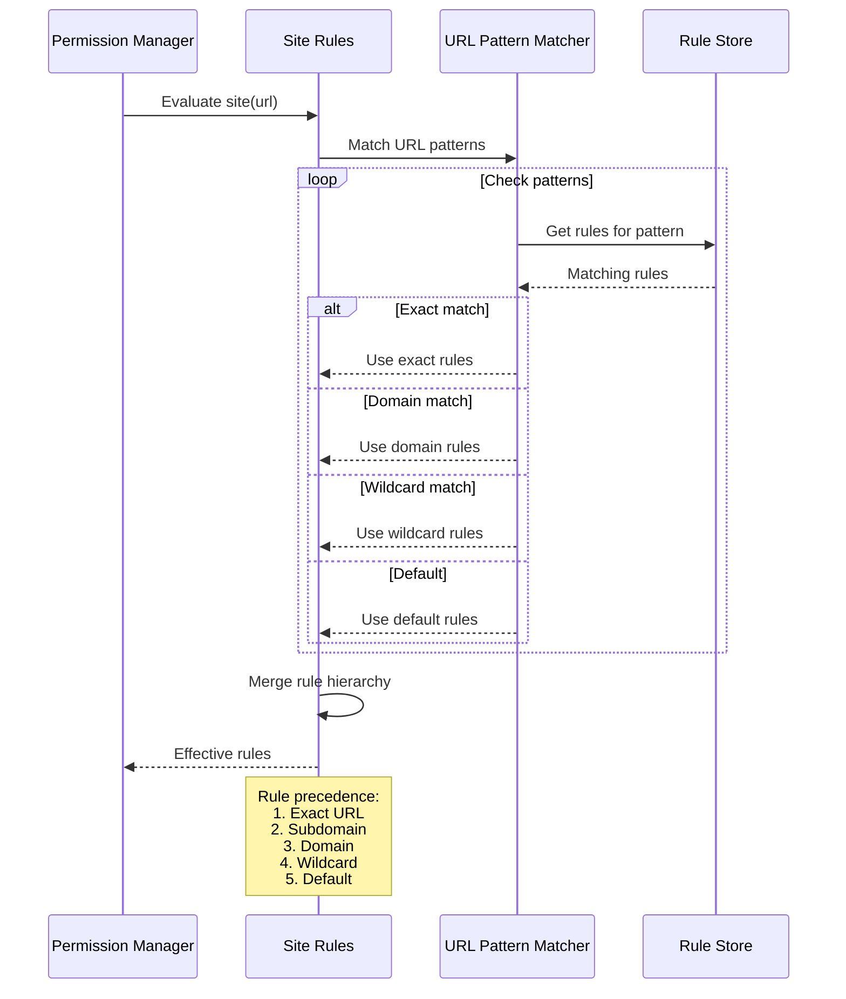
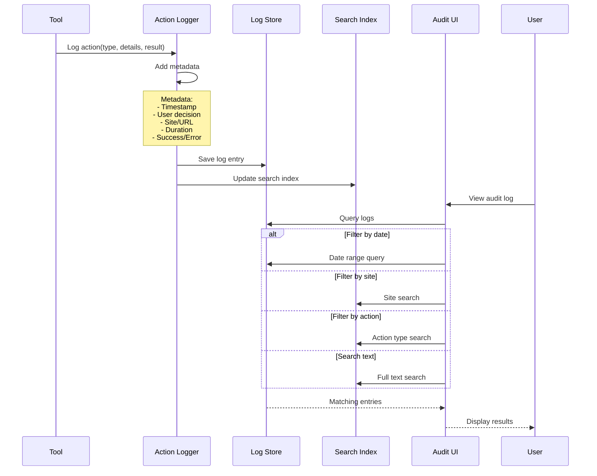
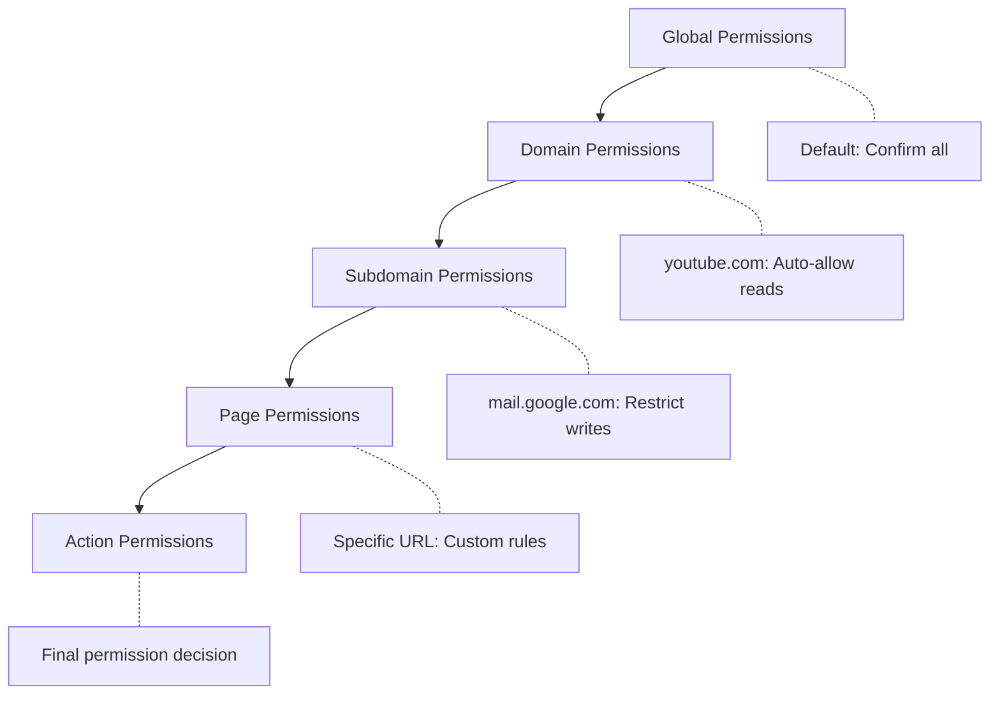

# PBI-8: Permission and Safety System

## Overview
Implement a comprehensive permission and safety system that gives users fine-grained control over AI actions, with site-specific rules, action confirmations, and detailed audit logging.

## Problem Statement
Users need to maintain control over what actions the AI can perform on their behalf. The system must balance automation convenience with safety, providing clear visibility and control over all automated actions.

## User Stories
As a user, I want fine-grained control over what actions the AI can perform so that I maintain control over my browsing experience.

## Technical Approach

### Permission System Architecture



### Permission Evaluation Flow



### Confirmation Dialog Flow



### Site-Specific Rules



### Action Audit Log



### Quick Toggle System

```mermaid
stateDiagram-v2
    [*] --> Enabled: Default
    
    Enabled --> Paused: User pauses
    Enabled --> Disabled: User disables
    
    Paused --> Enabled: Resume
    Paused --> Disabled: Disable
    
    Disabled --> Enabled: Re-enable
    
    state Enabled {
        [*] --> FullAuto: Whitelist match
        [*] --> Confirmations: Normal mode
        [*] --> ReadOnly: Safe mode
        
        FullAuto --> Confirmations: Remove whitelist
        Confirmations --> FullAuto: Add whitelist
        Confirmations --> ReadOnly: Enable safe mode
        ReadOnly --> Confirmations: Disable safe mode
    }
    
    state Paused {
        note: All actions blocked<br/>Temporary pause
    }
    
    state Disabled {
        note: Extension inactive<br/>No automation
    }
```

### Permission Inheritance



## Safety Features

### 1. Action Categories
- **Read-only**: DOM queries, page analysis
- **Low-risk**: Scrolling, hovering
- **Medium-risk**: Clicking, form filling
- **High-risk**: Submitting forms, navigation
- **Critical**: Payments, deletions

### 2. Confirmation Levels
- **Always**: Every action needs confirmation
- **Smart**: Based on risk assessment
- **Trusted**: Only high-risk actions
- **None**: Fully automated (not recommended)

### 3. Site Categories
- **Trusted**: User's own sites
- **Financial**: Banks, payment processors
- **Social**: Social media platforms
- **Shopping**: E-commerce sites
- **Unknown**: Unrecognized sites

## UX/UI Considerations
- Clear permission status in toolbar icon
- Quick toggle for enable/disable
- Unobtrusive confirmation dialogs
- Detailed but readable audit logs
- Bulk permission management
- Export/import permission settings

## Acceptance Criteria
- [ ] Permission system for different action types
- [ ] Site-specific whitelists and blacklists
- [ ] Confirmation dialogs with remember options
- [ ] Comprehensive audit log with search
- [ ] Quick toggle to pause/resume automation
- [ ] Permission inheritance and precedence
- [ ] Risk-based confirmation levels
- [ ] Settings export/import
- [ ] Clear permission status indicators

## Dependencies
- PBI-1: Extension foundation
- PBI-5: Web automation tools
- Chrome storage for persistence
- Chrome notifications API

## Open Questions
- Should permissions sync across devices?
- How long should audit logs be retained?
- Should we support regex patterns for URLs?
- Do we need permission templates?

## Related Tasks
Tasks will be created once this PBI is approved and moved to "Agreed" status.

[View in Backlog](../backlog.md#user-content-8)