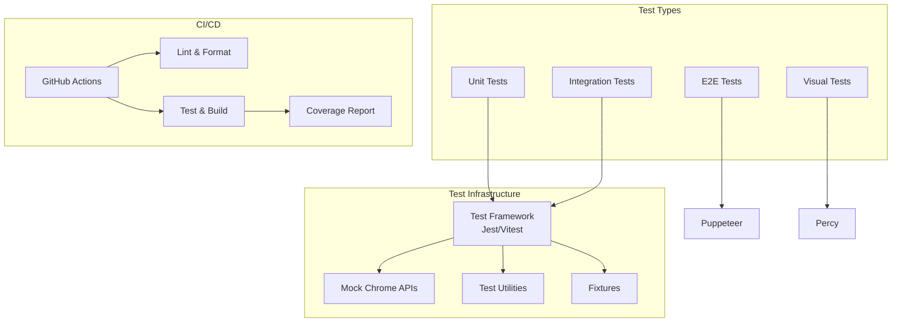
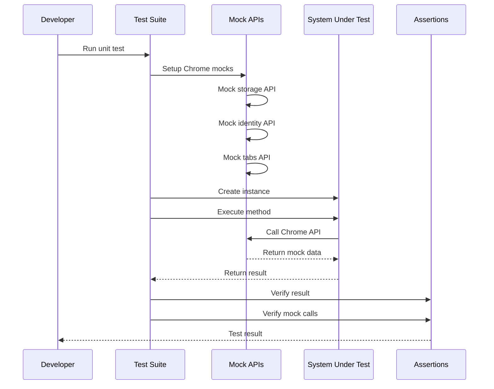
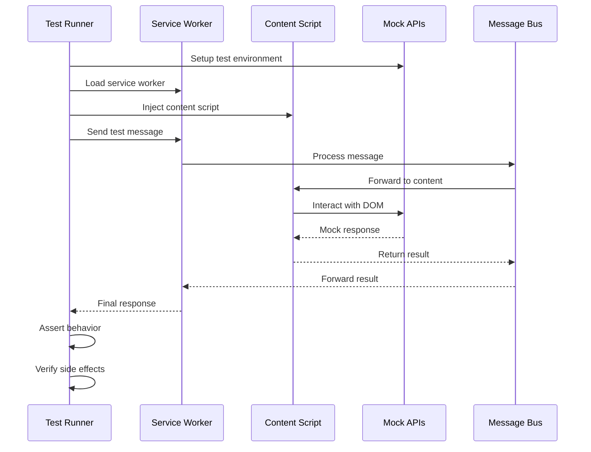
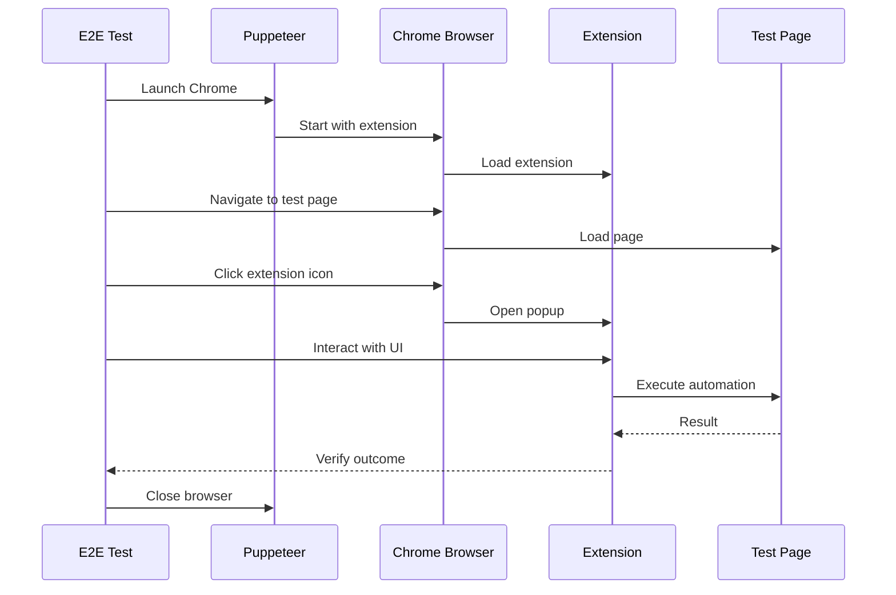
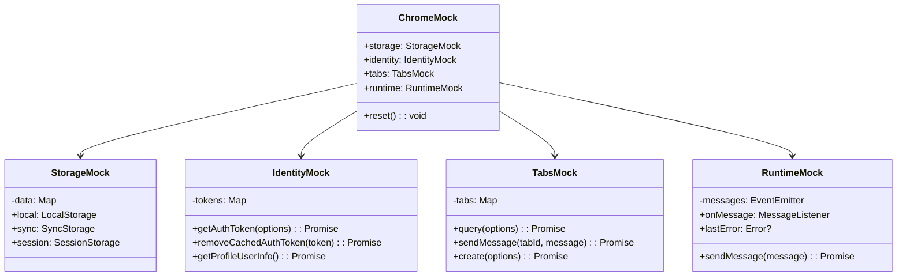
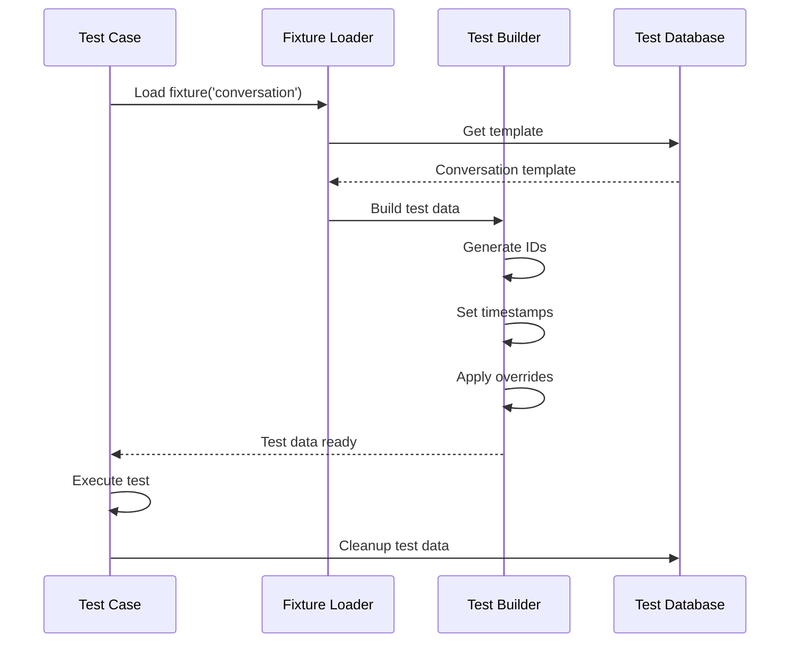
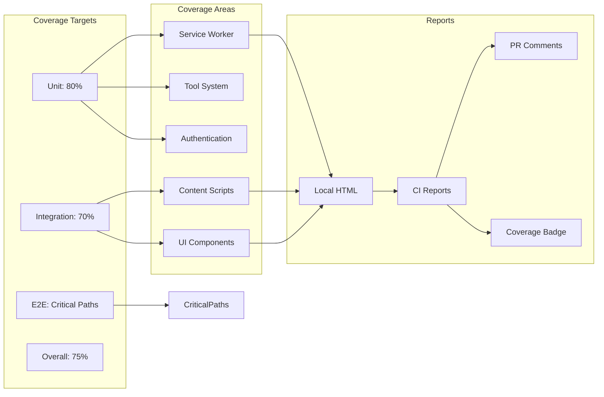
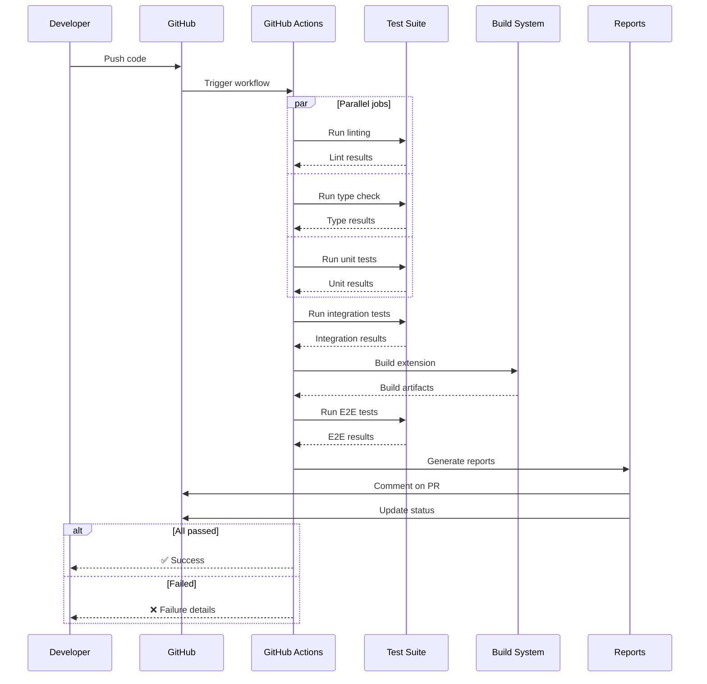

# PBI-9: Testing Infrastructure

## Overview
Establish comprehensive testing infrastructure including unit tests, integration tests, mocks for Chrome APIs, and end-to-end tests to ensure reliability and enable confident development.

## Problem Statement
Chrome extensions have unique testing challenges due to their multi-context architecture and dependency on Chrome APIs. We need a robust testing framework that covers all components and enables rapid development with confidence.

## User Stories
As a developer, I want comprehensive testing infrastructure so that I can ensure reliability and catch regressions.

## Technical Approach

### Testing Architecture



### Unit Test Strategy



### Integration Test Flow



### E2E Test Architecture



### Mock Chrome APIs



### Test Data Management



### Coverage Strategy



### CI/CD Pipeline



## Test Categories

### 1. Unit Tests
- Pure functions
- Class methods
- React components
- Tool implementations
- Utility functions

### 2. Integration Tests
- Message passing
- State synchronization
- API communication
- Tool execution
- Permission checks

### 3. E2E Tests
- Authentication flow
- Chat conversation
- Tool execution
- Permission dialogs
- Error recovery

### 4. Performance Tests
- Message latency
- Memory usage
- Storage efficiency
- API response times

## Testing Utilities

### 1. Test Builders
```typescript
const conversation = buildConversation()
  .withMessages(5)
  .withToolCalls(2)
  .build();
```

### 2. Async Helpers
```typescript
await waitForMessage('TOOL_COMPLETE');
await expectEventually(() => 
  screen.getByText('Success')
);
```

### 3. Chrome API Mocks
```typescript
mockChrome.storage.local.get
  .mockResolvedValue({ token: 'test' });
```

## UX/UI Considerations
- Test results in PR comments
- Coverage badges in README
- Local test runner UI
- Visual regression reports
- Performance benchmarks

## Acceptance Criteria
- [ ] Unit test framework configured (Jest/Vitest)
- [ ] Chrome API mocks implemented
- [ ] Integration test setup complete
- [ ] E2E tests with Puppeteer working
- [ ] CI/CD pipeline on GitHub Actions
- [ ] Coverage reporting integrated
- [ ] Test utilities and builders created
- [ ] Documentation for test patterns
- [ ] Pre-commit hooks for tests

## Dependencies
- Jest or Vitest test framework
- Puppeteer for E2E tests
- Testing Library for React
- GitHub Actions for CI/CD
- NYC for coverage reports

## Open Questions
- Should we use Jest or Vitest?
- Do we need visual regression testing?
- What's our target coverage percentage?
- Should we test across multiple Chrome versions?

## Related Tasks
Tasks will be created once this PBI is approved and moved to "Agreed" status.

[View in Backlog](../backlog.md#user-content-9)