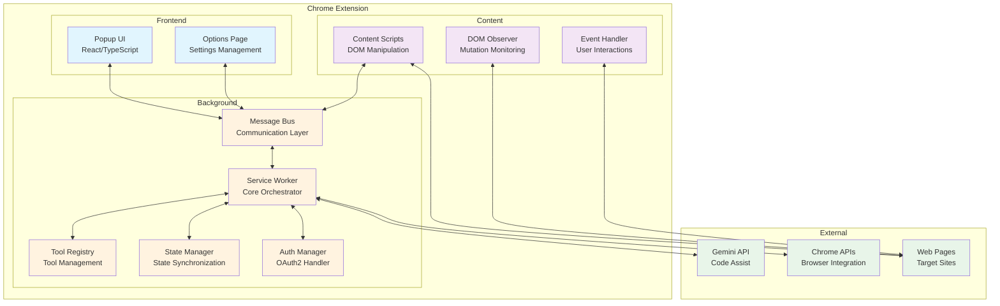
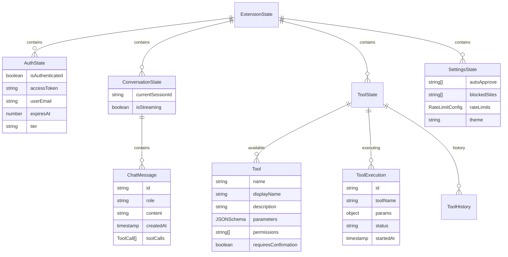
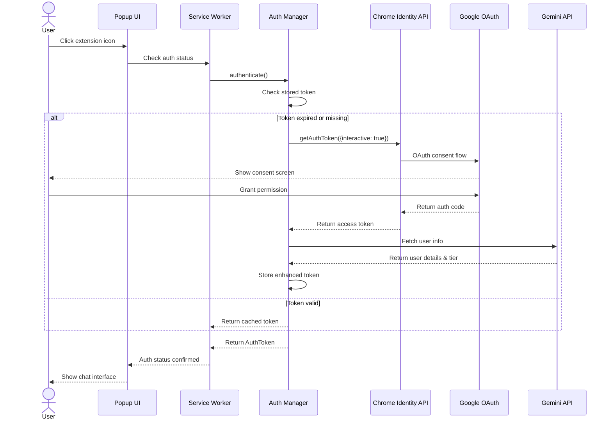
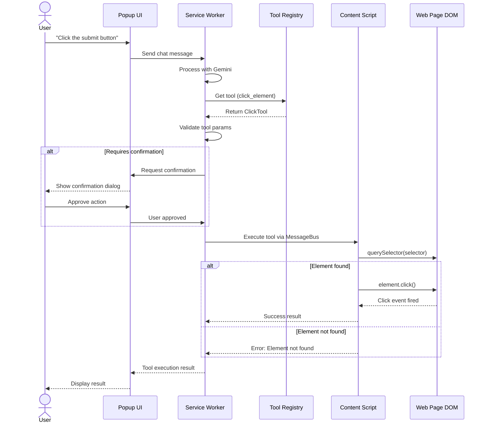
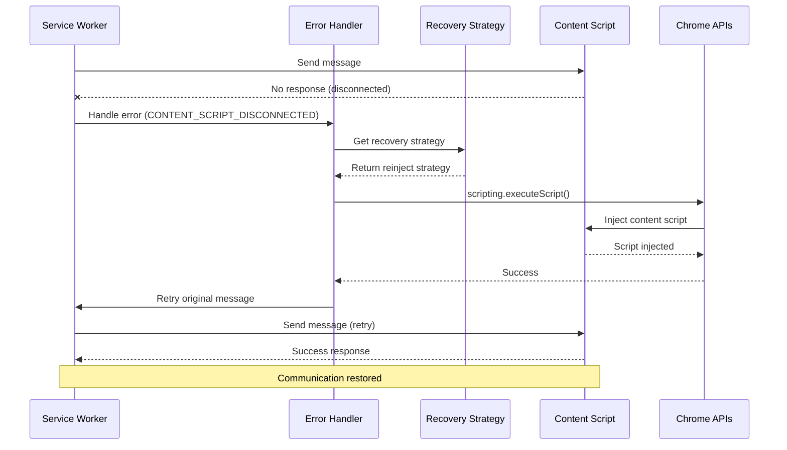
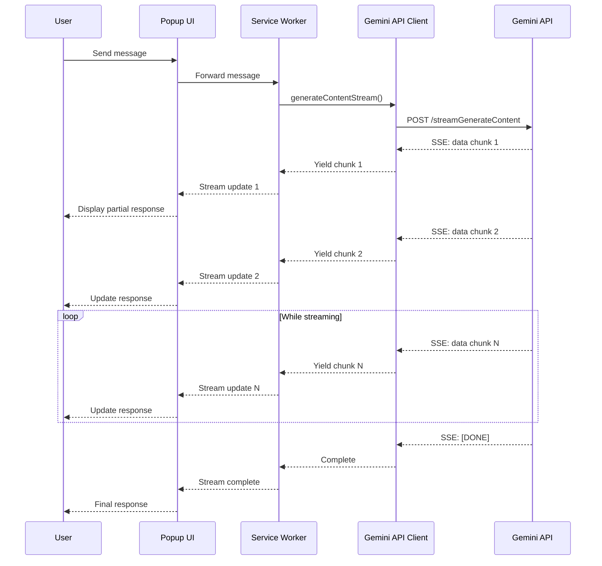

# Gemini Chrome Extension Technical Design

## Overview

This document presents the technical design for a Chrome extension that brings Gemini AI's conversational capabilities to web automation. The extension allows users to interact with web pages through natural language commands, leveraging Google's Gemini API for intelligent automation tasks.

## Architecture

### High-Level Architecture



### Component Diagram

```mermaid
component
    [Chrome Extension] as CE {
        [Popup UI] as PUI
        [Options UI] as OUI
        [Service Worker] as SW {
            [Message Bus] as MB
            [API Client] as AC
            [Tool Registry] as TR
            [State Manager] as SM
            [Auth Manager] as AM
        }
        [Content Scripts] as CS {
            [DOM Observer] as DO
            [Event Handler] as EH
            [Rate Limiter] as RL
        }
    }
    
    [Chrome APIs] as CAPI {
        [Identity API] as IA
        [Storage API] as SA
        [Tabs API] as TA
        [Scripting API] as SCA
    }
    
    [Gemini Services] as GS {
        [Code Assist API] as CAA
        [Generative Language API] as GLA
    }
    
    [Web Page] as WP
    
    PUI --> MB : User Commands
    OUI --> MB : Settings Updates
    MB --> CS : Tool Execution
    CS --> WP : DOM Manipulation
    
    AM --> IA : OAuth2 Flow
    SM --> SA : State Persistence
    SW --> TA : Tab Management
    SW --> SCA : Script Injection
    
    AC --> CAA : AI Requests
    AC --> GLA : Content Generation
```

### Data Model



### Core Components

1. **Service Worker (Background)**
   - Central message routing and coordination
   - Gemini API communication
   - Tool execution orchestration
   - State management
   - Chrome API integration

2. **Content Scripts**
   - DOM manipulation and inspection
   - Event handling and monitoring
   - Page-specific automation logic
   - Secure message passing

3. **Popup UI**
   - Chat interface for user interaction
   - Real-time streaming responses
   - Tool execution feedback
   - Settings management

4. **Options Page**
   - Advanced configuration
   - API key management
   - Permission settings
   - Tool preferences

## Key Sequence Diagrams

### Authentication Flow



### Tool Execution Flow



### Error Recovery Flow



### Streaming Response Flow



## Detailed Component Design

### 1. Authentication System

```typescript
// src/auth/AuthManager.ts
interface AuthConfig {
  clientId: string;
  scopes: string[];
  interactive: boolean;
}

class AuthManager {
  private static readonly SCOPES = [
    'https://www.googleapis.com/auth/generative-language',
    'https://www.googleapis.com/auth/cloud-platform',
    'https://www.googleapis.com/auth/userinfo.email',
    'https://www.googleapis.com/auth/userinfo.profile'
  ];

  async authenticate(interactive: boolean = true): Promise<AuthToken> {
    try {
      const token = await this.getStoredToken();
      if (token && !this.isTokenExpired(token)) {
        return token;
      }

      return await this.refreshAuth(interactive);
    } catch (error) {
      throw new AuthError('Authentication failed', error);
    }
  }

  private async refreshAuth(interactive: boolean): Promise<AuthToken> {
    return new Promise((resolve, reject) => {
      chrome.identity.getAuthToken({ interactive }, async (token) => {
        if (chrome.runtime.lastError) {
          reject(new AuthError(chrome.runtime.lastError.message));
          return;
        }

        const authToken = await this.enhanceToken(token);
        await this.storeToken(authToken);
        resolve(authToken);
      });
    });
  }

  private async enhanceToken(accessToken: string): Promise<AuthToken> {
    // Fetch user info and enhance token metadata
    const userInfo = await this.fetchUserInfo(accessToken);
    return {
      accessToken,
      userEmail: userInfo.email,
      expiresAt: Date.now() + 3600 * 1000, // 1 hour
      tier: await this.detectUserTier(accessToken)
    };
  }
}
```

**Manifest Configuration:**
```json
{
  "oauth2": {
    "client_id": "681255809395-oo8ft2oprdrnp9e3aqf6av3hmdib135j.apps.googleusercontent.com",
    "scopes": [
      "https://www.googleapis.com/auth/generative-language",
      "https://www.googleapis.com/auth/cloud-platform",
      "https://www.googleapis.com/auth/userinfo.email",
      "https://www.googleapis.com/auth/userinfo.profile"
    ]
  }
}
```

### 2. Message Bus Architecture

```typescript
// src/messaging/MessageBus.ts
enum MessageType {
  TOOL_EXECUTE = 'TOOL_EXECUTE',
  TOOL_RESULT = 'TOOL_RESULT',
  DOM_QUERY = 'DOM_QUERY',
  DOM_MUTATION = 'DOM_MUTATION',
  AUTH_REQUEST = 'AUTH_REQUEST',
  CHAT_MESSAGE = 'CHAT_MESSAGE',
  STATE_SYNC = 'STATE_SYNC'
}

interface Message<T = any> {
  id: string;
  type: MessageType;
  source: 'popup' | 'background' | 'content' | 'options';
  target: 'popup' | 'background' | 'content' | 'options' | 'all';
  payload: T;
  timestamp: number;
  tabId?: number;
  frameId?: number;
}

class MessageBus {
  private handlers = new Map<MessageType, Set<MessageHandler>>();
  private pendingResponses = new Map<string, PendingResponse>();

  constructor() {
    this.setupListeners();
  }

  async send<T, R>(message: Omit<Message<T>, 'id' | 'timestamp'>): Promise<R> {
    const fullMessage: Message<T> = {
      ...message,
      id: this.generateId(),
      timestamp: Date.now()
    };

    return new Promise((resolve, reject) => {
      const timeout = setTimeout(() => {
        this.pendingResponses.delete(fullMessage.id);
        reject(new Error('Message timeout'));
      }, 30000);

      this.pendingResponses.set(fullMessage.id, {
        resolve,
        reject,
        timeout
      });

      this.routeMessage(fullMessage);
    });
  }

  subscribe(type: MessageType, handler: MessageHandler): () => void {
    if (!this.handlers.has(type)) {
      this.handlers.set(type, new Set());
    }
    
    this.handlers.get(type)!.add(handler);
    
    return () => {
      this.handlers.get(type)?.delete(handler);
    };
  }

  private validateMessage(message: any, sender: chrome.runtime.MessageSender): boolean {
    if (sender.id !== chrome.runtime.id) return false;
    if (!message.type || !message.timestamp) return false;
    if (Date.now() - message.timestamp > 5000) return false;
    return true;
  }
}
```

### 3. State Management System

```typescript
// src/state/StateManager.ts
interface ExtensionState {
  auth: {
    isAuthenticated: boolean;
    token?: AuthToken;
    user?: UserInfo;
  };
  conversation: {
    messages: ChatMessage[];
    currentSessionId?: string;
    isStreaming: boolean;
  };
  tools: {
    available: Tool[];
    executing: Map<string, ToolExecution>;
    history: ToolExecutionHistory[];
  };
  settings: {
    autoApprove: string[];
    blockedSites: string[];
    rateLimits: RateLimitConfig;
    theme: 'light' | 'dark';
  };
}

class StateManager {
  private state: ExtensionState;
  private listeners = new Map<keyof ExtensionState, Set<StateListener>>();
  private syncDebouncer: NodeJS.Timeout | null = null;

  async initialize(): Promise<void> {
    const stored = await chrome.storage.local.get(['state']);
    this.state = this.mergeWithDefaults(stored.state);
    this.setupStorageListener();
  }

  get<K extends keyof ExtensionState>(key: K): ExtensionState[K] {
    return structuredClone(this.state[key]);
  }

  async update<K extends keyof ExtensionState>(
    key: K,
    updater: (current: ExtensionState[K]) => ExtensionState[K]
  ): Promise<void> {
    const newValue = updater(this.state[key]);
    this.state[key] = newValue;
    
    this.notifyListeners(key, newValue);
    this.scheduleSyncToStorage();
  }

  subscribe<K extends keyof ExtensionState>(
    key: K,
    listener: (value: ExtensionState[K]) => void
  ): () => void {
    if (!this.listeners.has(key)) {
      this.listeners.set(key, new Set());
    }
    
    this.listeners.get(key)!.add(listener);
    listener(this.state[key]); // Initial call
    
    return () => {
      this.listeners.get(key)?.delete(listener);
    };
  }

  private scheduleSyncToStorage(): void {
    if (this.syncDebouncer) {
      clearTimeout(this.syncDebouncer);
    }
    
    this.syncDebouncer = setTimeout(async () => {
      await chrome.storage.local.set({ state: this.state });
      this.syncDebouncer = null;
    }, 100);
  }
}
```

### 4. Tool System Architecture

```typescript
// src/tools/base/Tool.ts
interface ToolSchema {
  name: string;
  displayName: string;
  description: string;
  parameters: JSONSchema;
  permissions?: string[];
  hostPermissions?: string[];
  requiresConfirmation?: boolean;
}

abstract class WebAutomationTool<TParams = any, TResult = any> {
  constructor(protected schema: ToolSchema) {}

  abstract validateContext(tab: chrome.tabs.Tab): Promise<boolean>;
  
  abstract execute(
    params: TParams,
    context: ExecutionContext
  ): Promise<ToolResult<TResult>>;

  async requestPermissions(): Promise<boolean> {
    if (!this.schema.permissions?.length && !this.schema.hostPermissions?.length) {
      return true;
    }

    return new Promise((resolve) => {
      chrome.permissions.request({
        permissions: this.schema.permissions || [],
        origins: this.schema.hostPermissions || []
      }, resolve);
    });
  }

  validateParams(params: unknown): ValidationResult {
    // JSON Schema validation
    return validateAgainstSchema(params, this.schema.parameters);
  }
}

// src/tools/registry/ToolRegistry.ts
class ToolRegistry {
  private tools = new Map<string, WebAutomationTool>();
  private enabledTools = new Set<string>();

  register(tool: WebAutomationTool): void {
    this.tools.set(tool.schema.name, tool);
  }

  async discoverTools(): Promise<void> {
    // Register built-in tools
    this.register(new DOMQueryTool());
    this.register(new ClickElementTool());
    this.register(new FormFillTool());
    this.register(new WaitForElementTool());
    this.register(new YouTubePlaylistTool());
    
    // Load user preferences
    const settings = await chrome.storage.sync.get(['enabledTools']);
    if (settings.enabledTools) {
      this.enabledTools = new Set(settings.enabledTools);
    }
  }

  getAvailableTools(): ToolSchema[] {
    return Array.from(this.tools.values())
      .filter(tool => this.enabledTools.has(tool.schema.name))
      .map(tool => tool.schema);
  }
}
```

### 5. Web Automation Tools

```typescript
// src/tools/dom/DOMQueryTool.ts
class DOMQueryTool extends WebAutomationTool<DOMQueryParams, DOMQueryResult> {
  constructor() {
    super({
      name: 'dom_query',
      displayName: 'Query DOM Elements',
      description: 'Query and analyze DOM elements using CSS selectors',
      parameters: {
        type: 'object',
        properties: {
          selector: {
            type: 'string',
            description: 'CSS selector to query'
          },
          action: {
            type: 'string',
            enum: ['find', 'count', 'text', 'attributes', 'screenshot'],
            description: 'Action to perform on matched elements'
          },
          limit: {
            type: 'number',
            description: 'Maximum number of elements to return',
            default: 10
          },
          includeHidden: {
            type: 'boolean',
            description: 'Include hidden elements',
            default: false
          }
        },
        required: ['selector', 'action']
      }
    });
  }

  async validateContext(tab: chrome.tabs.Tab): Promise<boolean> {
    return tab.url?.startsWith('http') || tab.url?.startsWith('https');
  }

  async execute(
    params: DOMQueryParams,
    context: ExecutionContext
  ): Promise<ToolResult<DOMQueryResult>> {
    const result = await context.messageBus.send<DOMQueryParams, DOMQueryResult>({
      type: MessageType.DOM_QUERY,
      source: 'background',
      target: 'content',
      tabId: context.tab.id,
      payload: params
    });

    return {
      success: true,
      data: result,
      summary: this.generateSummary(result),
      displayData: this.formatForDisplay(result)
    };
  }

  private generateSummary(result: DOMQueryResult): string {
    switch (result.action) {
      case 'count':
        return `Found ${result.count} elements matching "${result.selector}"`;
      case 'find':
        return `Retrieved ${result.elements.length} elements`;
      default:
        return `Completed ${result.action} operation`;
    }
  }
}

// src/tools/youtube/YouTubePlaylistTool.ts
class YouTubePlaylistTool extends WebAutomationTool<YouTubeParams, YouTubeResult> {
  constructor() {
    super({
      name: 'youtube_playlist',
      displayName: 'YouTube Playlist Manager',
      description: 'Manage YouTube playlist items with rate limiting',
      parameters: {
        type: 'object',
        properties: {
          action: {
            type: 'string',
            enum: ['list_items', 'remove_items', 'reorder_items', 'get_stats']
          },
          options: {
            type: 'object',
            properties: {
              batchSize: {
                type: 'number',
                default: 10,
                minimum: 1,
                maximum: 50
              },
              delayMs: {
                type: 'number',
                default: 1000,
                minimum: 500
              },
              dryRun: {
                type: 'boolean',
                default: false
              }
            }
          }
        },
        required: ['action']
      },
      hostPermissions: ['https://www.youtube.com/*'],
      requiresConfirmation: true
    });
  }

  async validateContext(tab: chrome.tabs.Tab): Promise<boolean> {
    return tab.url?.includes('youtube.com/playlist') || false;
  }

  async execute(
    params: YouTubeParams,
    context: ExecutionContext
  ): Promise<ToolResult<YouTubeResult>> {
    // Use mutation observer for dynamic content
    const setupResult = await this.setupMutationObserver(context);
    
    if (!setupResult.success) {
      return {
        success: false,
        error: 'Failed to setup page monitoring'
      };
    }

    switch (params.action) {
      case 'remove_items':
        return await this.removeItemsWithRateLimit(params, context);
      case 'list_items':
        return await this.listPlaylistItems(context);
      default:
        throw new Error(`Unsupported action: ${params.action}`);
    }
  }

  private async setupMutationObserver(context: ExecutionContext): Promise<any> {
    return context.messageBus.send({
      type: MessageType.DOM_MUTATION,
      source: 'background',
      target: 'content',
      tabId: context.tab.id,
      payload: {
        action: 'observe',
        config: {
          selector: 'ytd-playlist-video-list-renderer',
          options: {
            childList: true,
            subtree: true
          }
        }
      }
    });
  }
}
```

### 6. Content Script Implementation

```typescript
// src/content/ContentScriptManager.ts
class ContentScriptManager {
  private messageBus: ContentMessageBus;
  private domObserver: DOMObserver;
  private rateLimiter: RateLimiter;

  constructor() {
    this.messageBus = new ContentMessageBus();
    this.domObserver = new DOMObserver();
    this.rateLimiter = new RateLimiter();
    
    this.initialize();
  }

  private initialize(): void {
    this.messageBus.subscribe(MessageType.DOM_QUERY, this.handleDOMQuery);
    this.messageBus.subscribe(MessageType.DOM_MUTATION, this.handleDOMMutation);
    this.messageBus.subscribe(MessageType.TOOL_EXECUTE, this.handleToolExecute);
    
    // Inject page context helpers
    this.injectPageContextScript();
  }

  private handleDOMQuery = async (message: Message<DOMQueryParams>) => {
    try {
      const { selector, action, limit, includeHidden } = message.payload;
      
      // Validate selector
      if (!this.isValidSelector(selector)) {
        throw new Error('Invalid CSS selector');
      }

      const elements = document.querySelectorAll(selector);
      const filtered = this.filterElements(elements, includeHidden);
      
      let result: DOMQueryResult;
      
      switch (action) {
        case 'count':
          result = { 
            action, 
            selector, 
            count: filtered.length 
          };
          break;
          
        case 'find':
          result = {
            action,
            selector,
            elements: Array.from(filtered)
              .slice(0, limit || 10)
              .map(el => this.serializeElement(el))
          };
          break;
          
        case 'text':
          result = {
            action,
            selector,
            texts: Array.from(filtered)
              .slice(0, limit || 10)
              .map(el => el.textContent?.trim() || '')
          };
          break;
          
        case 'attributes':
          result = {
            action,
            selector,
            elements: Array.from(filtered)
              .slice(0, limit || 10)
              .map(el => ({
                tag: el.tagName.toLowerCase(),
                attributes: this.getElementAttributes(el),
                text: el.textContent?.trim().substring(0, 100)
              }))
          };
          break;
      }

      return result;
    } catch (error) {
      throw new ToolError('DOM query failed', error);
    }
  };

  private serializeElement(element: Element): SerializedElement {
    const rect = element.getBoundingClientRect();
    
    return {
      tagName: element.tagName.toLowerCase(),
      id: element.id,
      className: element.className,
      textContent: element.textContent?.trim().substring(0, 200),
      isVisible: this.isElementVisible(element),
      position: {
        top: rect.top,
        left: rect.left,
        width: rect.width,
        height: rect.height
      },
      attributes: this.getElementAttributes(element)
    };
  }

  private isElementVisible(element: Element): boolean {
    const style = window.getComputedStyle(element);
    const rect = element.getBoundingClientRect();
    
    return (
      style.display !== 'none' &&
      style.visibility !== 'hidden' &&
      style.opacity !== '0' &&
      rect.width > 0 &&
      rect.height > 0
    );
  }
}

// src/content/DOMObserver.ts
class DOMObserver {
  private observers = new Map<string, MutationObserver>();
  
  observe(config: ObserverConfig): string {
    const id = this.generateId();
    const target = document.querySelector(config.selector);
    
    if (!target) {
      throw new Error(`Element not found: ${config.selector}`);
    }
    
    const observer = new MutationObserver((mutations) => {
      this.handleMutations(id, mutations, config);
    });
    
    observer.observe(target, config.options);
    this.observers.set(id, observer);
    
    return id;
  }
  
  private handleMutations(
    id: string, 
    mutations: MutationRecord[], 
    config: ObserverConfig
  ): void {
    const summary = this.summarizeMutations(mutations);
    
    if (config.callback) {
      config.callback(summary);
    }
    
    // Send to background if needed
    chrome.runtime.sendMessage({
      type: MessageType.DOM_MUTATION,
      payload: {
        observerId: id,
        summary
      }
    });
  }
}
```

### 7. API Client Implementation

```typescript
// src/api/GeminiAPIClient.ts
class GeminiAPIClient {
  private baseURL = 'https://generativelanguage.googleapis.com/v1beta';
  private codeAssistURL = 'https://cloudcode-pa.googleapis.com/v1internal';
  private authManager: AuthManager;
  private rateLimiter: APIRateLimiter;

  constructor(authManager: AuthManager) {
    this.authManager = authManager;
    this.rateLimiter = new APIRateLimiter();
  }

  async generateContent(request: GenerateContentRequest): Promise<GenerateContentResponse> {
    const token = await this.authManager.authenticate();
    
    const response = await this.rateLimiter.execute(async () => {
      return fetch(`${this.baseURL}/models/${request.model}:generateContent`, {
        method: 'POST',
        headers: {
          'Authorization': `Bearer ${token.accessToken}`,
          'Content-Type': 'application/json'
        },
        body: JSON.stringify({
          contents: request.contents,
          tools: request.tools,
          safetySettings: request.safetySettings,
          generationConfig: request.generationConfig
        })
      });
    });

    if (!response.ok) {
      throw new APIError(response.statusText, response.status);
    }

    return response.json();
  }

  async generateContentStream(
    request: GenerateContentRequest
  ): AsyncGenerator<GenerateContentChunk> {
    const token = await this.authManager.authenticate();
    
    const response = await fetch(
      `${this.baseURL}/models/${request.model}:streamGenerateContent?alt=sse`,
      {
        method: 'POST',
        headers: {
          'Authorization': `Bearer ${token.accessToken}`,
          'Content-Type': 'application/json'
        },
        body: JSON.stringify(request)
      }
    );

    if (!response.ok) {
      throw new APIError(response.statusText, response.status);
    }

    const reader = response.body!.getReader();
    const decoder = new TextDecoder();
    let buffer = '';

    while (true) {
      const { done, value } = await reader.read();
      if (done) break;

      buffer += decoder.decode(value, { stream: true });
      const lines = buffer.split('\n');
      buffer = lines.pop() || '';

      for (const line of lines) {
        if (line.startsWith('data: ')) {
          const data = line.slice(6);
          if (data === '[DONE]') return;
          
          try {
            const chunk = JSON.parse(data);
            yield chunk;
          } catch (e) {
            console.error('Failed to parse SSE data:', e);
          }
        }
      }
    }
  }
}

// src/api/APIRateLimiter.ts
class APIRateLimiter {
  private queue: QueueItem[] = [];
  private processing = false;
  private retryManager: RetryManager;

  constructor() {
    this.retryManager = new RetryManager({
      maxRetries: 5,
      initialDelay: 5000,
      maxDelay: 30000,
      backoffFactor: 2,
      jitter: 0.3
    });
  }

  async execute<T>(fn: () => Promise<T>): Promise<T> {
    return new Promise((resolve, reject) => {
      this.queue.push({ fn, resolve, reject });
      this.processQueue();
    });
  }

  private async processQueue(): Promise<void> {
    if (this.processing || this.queue.length === 0) return;
    
    this.processing = true;
    const item = this.queue.shift()!;
    
    try {
      const result = await this.retryManager.execute(item.fn);
      item.resolve(result);
    } catch (error) {
      item.reject(error);
    } finally {
      this.processing = false;
      
      // Process next item after a small delay
      setTimeout(() => this.processQueue(), 100);
    }
  }
}
```

### 8. Security Implementation

```typescript
// src/security/SecurityManager.ts
class SecurityManager {
  private csp: ContentSecurityPolicy;
  private permissions: PermissionManager;
  private validator: MessageValidator;

  constructor() {
    this.csp = new ContentSecurityPolicy();
    this.permissions = new PermissionManager();
    this.validator = new MessageValidator();
  }

  validateMessage(message: any, sender: chrome.runtime.MessageSender): boolean {
    // Validate sender
    if (sender.id !== chrome.runtime.id) {
      console.error('Message from unknown extension:', sender.id);
      return false;
    }

    // Validate message structure
    if (!this.validator.validateStructure(message)) {
      return false;
    }

    // Validate timestamp
    if (!this.validator.validateTimestamp(message.timestamp)) {
      return false;
    }

    // Validate permissions for the requested action
    if (!this.permissions.canExecute(message.type, sender.tab)) {
      return false;
    }

    return true;
  }

  async encryptSensitiveData(data: any): Promise<string> {
    const key = await this.getEncryptionKey();
    const encrypted = await crypto.subtle.encrypt(
      { name: 'AES-GCM', iv: crypto.getRandomValues(new Uint8Array(12)) },
      key,
      new TextEncoder().encode(JSON.stringify(data))
    );
    
    return btoa(String.fromCharCode(...new Uint8Array(encrypted)));
  }

  private async getEncryptionKey(): Promise<CryptoKey> {
    // Derive key from user-specific data
    const keyMaterial = await crypto.subtle.importKey(
      'raw',
      new TextEncoder().encode(chrome.runtime.id),
      'PBKDF2',
      false,
      ['deriveKey']
    );

    return crypto.subtle.deriveKey(
      {
        name: 'PBKDF2',
        salt: new TextEncoder().encode('gemini-extension'),
        iterations: 100000,
        hash: 'SHA-256'
      },
      keyMaterial,
      { name: 'AES-GCM', length: 256 },
      false,
      ['encrypt', 'decrypt']
    );
  }
}

// Manifest CSP configuration
{
  "content_security_policy": {
    "extension_pages": "script-src 'self'; object-src 'none'; connect-src https://generativelanguage.googleapis.com https://cloudcode-pa.googleapis.com"
  }
}
```

## Manifest V3 Configuration

```json
{
  "manifest_version": 3,
  "name": "Gemini Web Automation",
  "version": "1.0.0",
  "description": "AI-powered web automation using Gemini",
  
  "permissions": [
    "identity",
    "storage",
    "tabs",
    "webNavigation",
    "scripting",
    "notifications"
  ],
  
  "optional_permissions": [
    "debugger",
    "downloads"
  ],
  
  "host_permissions": [],
  
  "optional_host_permissions": [
    "https://*/*",
    "http://*/*"
  ],
  
  "oauth2": {
    "client_id": "681255809395-oo8ft2oprdrnp9e3aqf6av3hmdib135j.apps.googleusercontent.com",
    "scopes": [
      "https://www.googleapis.com/auth/generative-language",
      "https://www.googleapis.com/auth/cloud-platform",
      "https://www.googleapis.com/auth/userinfo.email",
      "https://www.googleapis.com/auth/userinfo.profile"
    ]
  },
  
  "background": {
    "service_worker": "js/background.js",
    "type": "module"
  },
  
  "action": {
    "default_popup": "popup.html",
    "default_title": "Gemini Web Automation",
    "default_icon": {
      "16": "images/icon16.png",
      "32": "images/icon32.png",
      "48": "images/icon48.png",
      "128": "images/icon128.png"
    }
  },
  
  "options_ui": {
    "page": "options.html",
    "open_in_tab": true
  },
  
  "content_scripts": [
    {
      "matches": ["<all_urls>"],
      "js": ["js/content.js"],
      "run_at": "document_idle",
      "all_frames": false
    }
  ],
  
  "web_accessible_resources": [
    {
      "resources": ["js/inject.js"],
      "matches": ["<all_urls>"]
    }
  ],
  
  "icons": {
    "16": "images/icon16.png",
    "32": "images/icon32.png",
    "48": "images/icon48.png",
    "128": "images/icon128.png"
  },
  
  "content_security_policy": {
    "extension_pages": "script-src 'self'; object-src 'none';"
  }
}
```

## Development Workflow

### Build Configuration

```typescript
// vite.config.ts
import { defineConfig } from 'vite';
import react from '@vitejs/plugin-react';
import { crx } from '@crxjs/vite-plugin';
import manifest from './manifest.json';

export default defineConfig({
  plugins: [
    react(),
    crx({ manifest })
  ],
  build: {
    rollupOptions: {
      input: {
        popup: 'src/popup/index.html',
        options: 'src/options/index.html',
        background: 'src/background/index.ts',
        content: 'src/content/index.ts'
      }
    }
  }
});
```

### Testing Strategy

```typescript
// tests/integration/tool-execution.test.ts
describe('Tool Execution', () => {
  let mockTab: chrome.tabs.Tab;
  let messageBus: MessageBus;
  let toolRegistry: ToolRegistry;

  beforeEach(async () => {
    mockTab = createMockTab('https://example.com');
    messageBus = new MessageBus();
    toolRegistry = new ToolRegistry();
    
    await toolRegistry.discoverTools();
  });

  it('should execute DOM query tool', async () => {
    const tool = toolRegistry.getTool('dom_query');
    const context = createExecutionContext(mockTab, messageBus);
    
    const result = await tool.execute({
      selector: '.test-element',
      action: 'count'
    }, context);
    
    expect(result.success).toBe(true);
    expect(result.data.count).toBeGreaterThan(0);
  });

  it('should require confirmation for destructive actions', async () => {
    const tool = toolRegistry.getTool('youtube_playlist');
    const confirmSpy = jest.spyOn(tool, 'requestConfirmation');
    
    await tool.execute({
      action: 'remove_items'
    }, createExecutionContext(mockTab, messageBus));
    
    expect(confirmSpy).toHaveBeenCalled();
  });
});
```

## Error Handling and Recovery

```typescript
// src/errors/ErrorHandler.ts
class ExtensionErrorHandler {
  private errorLog: ErrorLog[] = [];
  private recoveryStrategies = new Map<ErrorType, RecoveryStrategy>();

  constructor() {
    this.registerRecoveryStrategies();
    this.setupGlobalHandlers();
  }

  async handleError(error: ExtensionError, context?: ErrorContext): Promise<void> {
    // Log error
    this.logError(error, context);
    
    // Attempt recovery
    const strategy = this.recoveryStrategies.get(error.type);
    if (strategy) {
      try {
        await strategy.recover(error, context);
      } catch (recoveryError) {
        console.error('Recovery failed:', recoveryError);
        await this.notifyUser(error, 'Recovery failed');
      }
    } else {
      await this.notifyUser(error);
    }
  }

  private registerRecoveryStrategies(): void {
    this.recoveryStrategies.set(ErrorType.AUTH_FAILED, {
      recover: async (error, context) => {
        // Clear cached token and retry
        await chrome.identity.clearAllCachedAuthTokens();
        if (context?.retry) {
          await context.retry();
        }
      }
    });

    this.recoveryStrategies.set(ErrorType.CONTENT_SCRIPT_DISCONNECTED, {
      recover: async (error, context) => {
        // Reinject content script
        if (context?.tabId) {
          await chrome.scripting.executeScript({
            target: { tabId: context.tabId },
            files: ['js/content.js']
          });
        }
      }
    });
  }
}
```

## Performance Optimization

```typescript
// src/performance/PerformanceMonitor.ts
class PerformanceMonitor {
  private metrics = new Map<string, PerformanceMetric>();
  
  startMeasure(name: string): () => void {
    const start = performance.now();
    
    return () => {
      const duration = performance.now() - start;
      this.recordMetric(name, duration);
    };
  }

  async reportMetrics(): Promise<void> {
    const report = {
      timestamp: Date.now(),
      metrics: Array.from(this.metrics.entries()).map(([name, metric]) => ({
        name,
        average: metric.getAverage(),
        p95: metric.getPercentile(95),
        count: metric.count
      }))
    };

    // Store locally for analysis
    await chrome.storage.local.set({
      performanceReport: report
    });
  }
}
```

## Deployment and Distribution

### Chrome Web Store Requirements

1. **Privacy Policy**: Required for extensions that handle user data
2. **Screenshots**: At least 1 screenshot (1280x800 or 640x400)
3. **Promotional Images**: Optional but recommended
4. **Detailed Description**: Clear explanation of features and permissions
5. **Support URL**: Link to documentation or support

### Build Script

```bash
#!/bin/bash
# build.sh

# Clean previous builds
rm -rf dist/

# Run tests
npm test

# Build production bundle
npm run build

# Create ZIP for Chrome Web Store
cd dist
zip -r ../gemini-web-automation.zip .
cd ..

# Generate source code bundle (required for review)
zip -r source-code.zip src/ package.json tsconfig.json vite.config.ts

echo "Build complete! Files ready for upload:"
echo "- gemini-web-automation.zip (for Chrome Web Store)"
echo "- source-code.zip (for review process)"
```

## Conclusion

This technical design provides a robust foundation for building a Gemini-powered Chrome extension for web automation. It addresses all the security concerns, architectural issues, and missing components identified in the validation report while maintaining the best practices from the Gemini CLI implementation.

Key improvements include:
- Proper Manifest V3 architecture
- Secure message passing with validation
- Comprehensive error handling and recovery
- Type-safe implementation with TypeScript
- Scalable tool system with proper abstractions
- Performance monitoring and optimization
- Complete testing strategy

The design is ready for implementation following the phased approach outlined in the product backlog.

## Appendix: OAuth2 Authentication FAQ

### Q: Why is OAuth2 configuration needed if users are already signed into Chrome with Google?

**A: The OAuth2 configuration is essential for accessing the free tier benefits, not for making users sign in separately.**

Here's what actually happens:

#### The User Experience
1. **User is already signed into Chrome** with their Google account
2. **User installs the extension** - no authentication needed yet
3. **User clicks the extension** to use Gemini features
4. **First time only**: Chrome shows a consent screen asking "Gemini Extension wants to access your Google Account" with [Allow] and [Deny] buttons
5. **After consent**: The extension silently retrieves tokens using the Chrome user's existing Google session - no separate login required

#### Why OAuth2 Configuration is Still Required

The `oauth2` section in manifest.json serves these purposes:

1. **Registers your extension** with Google's OAuth system
2. **Declares required permissions** (scopes) that your extension needs
3. **Enables the consent flow** for first-time users
4. **Allows access to user-specific quotas and the generous free tier**

```json
{
  "oauth2": {
    "client_id": "681255809395-oo8ft2oprdrnp9e3aqf6av3hmdib135j.apps.googleusercontent.com",
    "scopes": [
      "https://www.googleapis.com/auth/generative-language",
      "https://www.googleapis.com/auth/cloud-platform",
      "https://www.googleapis.com/auth/userinfo.email",
      "https://www.googleapis.com/auth/userinfo.profile"
    ]
  }
}
```

#### OAuth2 vs API Key Approach

**OAuth2 (Recommended for this project):**
- ✅ Users access their own generous free tier quotas
- ✅ Per-user tracking and quotas
- ✅ No API keys embedded in extension code
- ✅ Access to Code Assist features
- ✅ Better security - tokens are managed by Chrome
- ⚠️ Requires one-time consent screen

**API Key (Not recommended):**
- ❌ API key must be embedded in extension (security risk)
- ❌ Shared quota across all users
- ❌ No access to user-specific features
- ❌ Developer pays for all usage
- ✅ No consent screen needed

#### Key Clarification

The original draft spec's claim about "eliminating OAuth configuration entirely" was incorrect. While Chrome's identity API does simplify the OAuth flow significantly (no redirect URIs, no manual token management), you still need:

1. The `oauth2` manifest configuration
2. A registered OAuth client ID
3. Proper scope declarations

However, this does NOT mean users need to sign in separately - the extension leverages their existing Chrome/Google session, making the authentication process seamless after the initial consent.